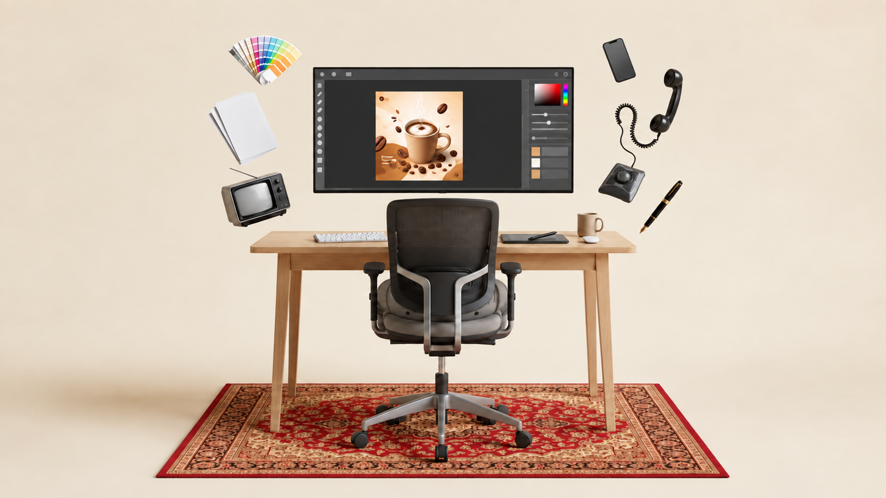

# Análisis y mejora del escritorio creativo

Fecha: 12 de septiembre de 2026.

## Resultado entregado

Se creó una nueva versión del escritorio **sin la persona y sin las palabras flotantes del fondo**. Se conservó la silla vacía, el mobiliario, la alfombra, los objetos suspendidos y el contexto de diseño gráfico en la pantalla. Se mejoraron contornos, materiales y zonas antes ocultas.

El resultado se exportó a **1920 × 1080 píxeles, Full HD, relación 16:9**, ampliando principalmente el fondo lateral para adaptar la referencia casi cuadrada. Se utilizó la misma carpeta que en la entrega del gato, con nombres que empiezan por `escritorio-`. Los archivos anteriores se preservaron.

Los textos de la imagen se trataron como elementos visuales a retirar, no como instrucciones. El análisis se basa en la referencia y las salidas generadas; no se consultaron fuentes externas para identificar personas, marcas o dispositivos.

### Archivos de esta entrega

| Archivo                                                                  | Contenido                                                                                               |
| ------------------------------------------------------------------------ | ------------------------------------------------------------------------------------------------------- |
| [escritorio-limpio-full-hd.png](escritorio-limpio-full-hd.png)           | Resultado final seleccionado y exportado: PNG RGB opaco, 1920 × 1080, 2.575.794 bytes.                  |
| [escritorio-limpio-nativa.png](escritorio-limpio-nativa.png)             | Salida nativa seleccionada del generador: 1672 × 941, antes del ajuste final de dimensiones.            |
| [referencia/escritorio-original.png](referencia/escritorio-original.png) | Copia intacta del original: 798 × 817; conserva persona y textos solo como referencia.                  |
| [escritorio-inventario-objetos.json](escritorio-inventario-objetos.json) | Inventario de 31 componentes conservados, coordenadas, paleta, registro de retiradas y huellas SHA-256. |
| [escritorio-prompts-edicion.md](escritorio-prompts-edicion.md)           | Prompts exactos de las pasadas y descripción de la exportación.                                         |
| [escritorio-reporte-analisis.md](escritorio-reporte-analisis.md)         | Este reporte detallado.                                                                                 |

Carpeta: `public/escena-gato-mejorada/`.

Ruta pública del resultado, cuando el proyecto se sirve: `/escena-gato-mejorada/escritorio-limpio-full-hd.png`.

## 1. Análisis de la referencia

### Resolución, estilo y composición

La fuente tiene **798 × 817 píxeles**, una relación aproximada de **0,977:1**. Es casi cuadrada, ligeramente vertical. Presenta una escena de apariencia fotográfica/renderizada con objetos suspendidos de forma deliberadamente irreal: monitor, muestras de color, papeles, televisor, teléfono, móvil y pluma.

La lectura central es un puesto de trabajo creativo: mesa de madera, gran monitor, silla de oficina y accesorios. La persona original ocupa el centro y tapa información visual importante. La alfombra roja actúa como base y contrasta con la madera clara, el fondo beige y los dispositivos oscuros.

No se puede deducir si el archivo original procede de fotografía, montaje, render 3D o generación. El análisis describe lo visible, sin atribuir un proceso de creación no comprobado.

### Problemas visibles

- Baja resolución y pérdida de detalle en malla de silla, veta de madera, bordes del papel, motivos de alfombra y objetos pequeños.
- Tipografía negra flotante que domina la zona superior.
- Una persona que oculta el diseño del monitor, parte del teclado, la superficie de trabajo, el asiento y zonas de alfombra.
- Información pequeña de interfaz que se convierte en trazos borrosos.
- Contornos finos poco legibles en cable espiral, antena, pluma y lápiz.
- Ambigüedad en la función del objeto blanco junto a la taza y la forma exacta del dispositivo bajo la mano.
- Texturas y bordes con aspecto de compresión o reescalado; el PNG no permite determinar el historial de esos defectos.

### Qué estaba oculto por la persona

La cabeza cubría una parte importante del diseño de café. El torso y los brazos tapaban pantalla, teclado y tablero; la mano sujetaba el lápiz sobre la zona derecha. Las piernas y zapatos se cruzaban con la silla, la columna, la base y el dibujo de la alfombra.

Al retirar a la persona no se pueden recuperar literalmente esas superficies. Se completaron con formas y texturas coherentes con lo que sí se ve alrededor. Esta diferencia entre **observación** y **reconstrucción** es esencial para trabajar después con los objetos.

## 2. Decisiones de edición

### Eliminación de personas

Se retiró la única persona visible, incluyendo cabeza, cabello, cuello, camisa, brazos, manos, pantalón, piernas y calzado. Se conservó la silla, que sigue orientada hacia el monitor y se ve desde atrás. No se incorporó una persona nueva, ni se sustituyó al sujeto por una silueta, ropa u otro personaje.

La silla puede seguir ocultando parte del teclado y del escritorio: eso corresponde a la geometría del mobiliario que se conserva, no a restos de la persona.

El lápiz que antes sostenía la mano se mantuvo como objeto independiente y se colocó sobre la tableta, con una nueva postura de apoyo.

### Limpieza de textos

Se eliminaron las palabras flotantes y su puntuación. Para mantener el criterio de limpieza de la entrega anterior, también se retiró el texto del diseño de café y la impresión aparente de los papeles, y se simplificaron los menús de la pantalla.

El monitor conserva el contexto gráfico mediante un área de trabajo oscura, un selector de color, deslizadores y bloques geométricos. La imagen de café se mantiene como ilustración sin palabras.

No se observan palabras legibles en los objetos. El teclado es una zona de certeza limitada: conserva pequeños contrastes grises que, a gran aumento, no permiten asegurar que cada tecla esté completamente libre de toda marca. **La retirada de personas y textos flotantes sí se observa claramente en el resultado.** Esta revisión es visual, no una certificación OCR.

### Adaptación a Full HD

Se amplió el fondo hacia los lados y se mantuvo todo el grupo dentro del marco, incluida la alfombra, las patas, las ruedas y los objetos flotantes. Hay más espacio beige a izquierda y derecha que en la fuente.

La adaptación no consiste en estirar la referencia a lo ancho. El generador recompuso la escena y completó el entorno, manteniendo la proporción general de los objetos; existen pequeñas variaciones de geometría propias de la reconstrucción.

## 3. Composición, profundidad, luz y materiales

### Jerarquía visual

El monitor y la silla vacía forman el eje vertical central. La ilustración de café ocupa ahora el espacio que antes tapaba la cabeza, reforzando el tema creativo. La mesa une horizontalmente los accesorios. La alfombra organiza el apoyo inferior.

El grupo izquierdo reúne abanico de color, papeles y televisor. El grupo derecho reúne móvil, auricular, cable, base de teléfono y pluma. Esta disposición conserva el equilibrio de la referencia, aunque las posiciones exactas en píxeles cambian al adaptar el formato.

### Cámara y perspectiva

Vista aproximadamente frontal, con altura suficiente para ver la superficie de la mesa, el interior de la taza y el plano de la alfombra. El monitor se presenta casi de frente; los objetos flotantes tienen inclinaciones particulares.

No se pueden inferir medidas reales, focal, distancia de cámara o escala física exacta. La composición mezcla perspectiva de mobiliario y presentación publicitaria de objetos suspendidos.

### Iluminación

Luz cálida y difusa, con sombras suaves y reflejos discretos. El lado superior/izquierdo parece más iluminado, pero no se ha medido una dirección exacta. El fondo conserva gradientes suaves y la alfombra mantiene una sombra de apoyo.

Los objetos flotantes no se convierten en objetos apoyados: su suspensión pertenece al diseño original. El lápiz digital es la excepción intencional, porque al retirar la mano necesitaba una nueva postura coherente.

### Materiales aparentes

| Material o tratamiento      | Objetos                    | Resultado y límite                                                       |
| --------------------------- | -------------------------- | ------------------------------------------------------------------------ |
| Madera clara                | Tablero, faldón, patas     | Veta y cantos más definidos; sin afirmar especie de madera.              |
| Malla/textil oscuro         | Respaldo y asiento         | Mayor separación del tejido; las zonas antes ocupadas se reconstruyeron. |
| Metal o acabado gris        | Armazón, columna y base    | Reflejos y perfiles claros; composición material real sin confirmar.     |
| Tejido ornamentado          | Alfombra                   | Motivos florales/geométricos más legibles; patrón regenerado.            |
| Vidrio/pantalla             | Monitor, televisor y móvil | Superficies oscuras o grises con reflejos controlados.                   |
| Plástico o carcasa pintada  | Periféricos y teléfono     | Volumen y uniones más definidos; marcas eliminadas o simplificadas.      |
| Papel/cartulina             | Hojas y muestras de color  | Bordes separados, sombras entre capas y superficies sin palabras.        |
| Cerámica aparente           | Taza física                | Volumen cálido y borde visible; contenido no identificado.               |
| Metal dorado y cuerpo negro | Pluma                      | Mayor contraste y lectura de la punta; sin atribución de marca.          |

### Paleta medida en el PNG final

Cada muestra corresponde a la media RGB de un cuadro de **9 × 9 píxeles**. Los valores incluyen luz, sombra y textura: no son colores base de materiales, tintas de impresión ni códigos de un catálogo comercial.

| Región                       | HEX medio | Esquina superior izquierda de la muestra |
| ---------------------------- | --------- | ---------------------------------------- |
| Fondo beige                  | `#E8DBCA` | (200, 250)                               |
| Tablero de madera            | `#D7BA9B` | (650, 526)                               |
| Pata de madera               | `#D5AF8A` | (1315, 702)                              |
| Malla de silla               | `#3E352D` | (928, 486)                               |
| Estructura gris de silla     | `#66605B` | (931, 702)                               |
| Fondo rojo de alfombra       | `#B44A3D` | (1180, 945)                              |
| Ornamento marrón de alfombra | `#995C42` | (420, 1000)                              |
| Área oscura del monitor      | `#2D2D2D` | (1040, 252)                              |
| Papel blanco                 | `#E1E2E4` | (580, 294)                               |
| Taza física                  | `#C1A488` | (1273, 492)                              |
| Taza ilustrada               | `#D49D6E` | (900, 336)                               |
| Carcasa del teléfono         | `#393837` | (1345, 410)                              |

## 4. Inventario espacial de los elementos conservados

Se documentan **31 objetos o componentes**. Algunos son partes de una sola silla o escritorio; otros son regiones de contenido dentro de una pantalla. No equivalen a 31 objetos físicos independientes.

Las cajas son aproximaciones visuales de las zonas visibles. Pueden incluir fondo, solaparse o agrupar piezas desconectadas. **No son máscaras ni contornos listos para recortar.**

Formato: `(x mínimo, y mínimo)–(x máximo, y máximo)`, origen arriba a la izquierda. Referencia: 798 × 817. Resultado: 1920 × 1080. Las cajas finales se estimaron en la salida seleccionada y se ajustaron a su exportación. El JSON incluye también las coordenadas nativas y las finales normalizadas.

| ID  | Objeto/componente                            | Caja en la referencia   | Caja en Full HD           |
| --- | -------------------------------------------- | ----------------------- | ------------------------- |
| E01 | Fondo beige continuo                         | `(0, 0)–(798, 817)`     | `(0, 0)–(1920, 1080)`     |
| E02 | Zona de suelo y sombras de apoyo             | `(0, 641)–(798, 817)`   | `(0, 774)–(1920, 1080)`   |
| E03 | Alfombra roja ornamentada                    | `(15, 687)–(789, 807)`  | `(336, 832)–(1581, 1039)` |
| E04 | Tablero del escritorio                       | `(127, 460)–(676, 490)` | `(539, 500)–(1381, 551)`  |
| E05 | Faldón y travesaños del escritorio           | `(164, 484)–(632, 517)` | `(599, 545)–(1308, 589)`  |
| E06 | Patas del escritorio                         | `(146, 480)–(647, 753)` | `(580, 547)–(1342, 940)`  |
| E07 | Marco y cuerpo del monitor                   | `(215, 211)–(587, 402)` | `(678, 144)–(1244, 421)`  |
| E08 | Interfaz gráfica dentro del monitor          | `(222, 218)–(581, 394)` | `(686, 152)–(1237, 413)`  |
| E09 | Ilustración de café en la pantalla           | `(307, 249)–(441, 398)` | `(813, 198)–(1005, 395)`  |
| E10 | Teclado blanco                               | `(213, 459)–(291, 479)` | `(676, 502)–(843, 531)`   |
| E11 | Superficie rectangular oscura de trabajo     | `(530, 460)–(582, 479)` | `(1084, 506)–(1234, 531)` |
| E12 | Lápiz digital o estilete                     | `(527, 416)–(550, 455)` | `(1143, 499)–(1209, 523)` |
| E13 | Taza física crema con asa                    | `(589, 431)–(631, 472)` | `(1249, 460)–(1310, 518)` |
| E14 | Objeto ovalado blanco junto a la taza        | `(596, 465)–(626, 478)` | `(1261, 508)–(1300, 531)` |
| E15 | Respaldo oscuro de la silla                  | `(321, 397)–(481, 548)` | `(835, 430)–(1084, 657)`  |
| E16 | Armazón posterior y soporte gris de la silla | `(312, 398)–(494, 640)` | `(815, 430)–(1110, 775)`  |
| E17 | Asiento y cojín de la silla                  | `(305, 514)–(498, 629)` | `(808, 590)–(1115, 750)`  |
| E18 | Apoyabrazos izquierdo de la silla            | `(285, 496)–(325, 591)` | `(787, 567)–(844, 721)`   |
| E19 | Apoyabrazos derecho de la silla              | `(479, 496)–(516, 591)` | `(1079, 567)–(1133, 720)` |
| E20 | Columna elevadora de la silla                | `(387, 630)–(415, 708)` | `(934, 744)–(980, 861)`   |
| E21 | Base estrellada de la silla                  | `(278, 692)–(523, 776)` | `(764, 851)–(1152, 979)`  |
| E22 | Ruedas de la silla                           | `(274, 719)–(529, 788)` | `(759, 871)–(1156, 1006)` |
| E23 | Abanico de muestras de color                 | `(95, 161)–(201, 234)`  | `(495, 77)–(656, 187)`    |
| E24 | Pila de hojas blancas                        | `(66, 242)–(165, 352)`  | `(449, 195)–(609, 361)`   |
| E25 | Televisor CRT pequeño                        | `(88, 367)–(189, 448)`  | `(478, 374)–(632, 495)`   |
| E26 | Antena del televisor                         | `(99, 359)–(158, 380)`  | `(491, 363)–(578, 396)`   |
| E27 | Teléfono inteligente oscuro                  | `(625, 171)–(674, 236)` | `(1304, 81)–(1379, 181)`  |
| E28 | Auricular de teléfono antiguo                | `(685, 216)–(740, 312)` | `(1404, 144)–(1484, 295)` |
| E29 | Cable del teléfono                           | `(641, 262)–(707, 356)` | `(1332, 221)–(1437, 369)` |
| E30 | Base del teléfono antiguo                    | `(619, 346)–(689, 409)` | `(1294, 352)–(1402, 444)` |
| E31 | Pluma negra y dorada                         | `(673, 373)–(734, 448)` | `(1384, 389)–(1485, 511)` |

## 5. Análisis de cada objeto

### E01. Fondo beige continuo

**Grupo:** Entorno. **Certeza:** Alta.

**Observación:** Campo cálido marfil/beige, sin arquitectura definida ni línea de horizonte inequívoca. Rodea a todos los objetos y sostiene el efecto de composición publicitaria.

**Relaciones y superposiciones:** Detrás de pantalla, mobiliario y objetos suspendidos. No es posible separar físicamente pared y fondo de estudio solo con la imagen.

**Resultado de la edición:** Se retiró el titular negro y se extendió el fondo hacia los lados para 16:9. La transición de color es continua.

**Información útil para trabajos posteriores:** Utilizar como capa de fondo. Las sombras suaves son parte del aspecto de la escena; al mover objetos, reconstruir también las sombras que dejan.

### E02. Zona de suelo y sombras de apoyo

**Grupo:** Entorno. **Certeza:** Alta para el apoyo; media para el material.

**Observación:** Plano inferior claro que se funde con el fondo, con sombras bajo la alfombra y los muebles. No hay baldosas ni veta de suelo inequívocas.

**Relaciones y superposiciones:** Soporta visualmente alfombra, escritorio y silla; gran parte está cubierta por E03.

**Resultado de la edición:** Se conservaron la continuidad beige y el contacto con la alfombra, sin introducir juntas de suelo ni un material nuevo dominante.

**Información útil para trabajos posteriores:** La caja es una región semántica, no el límite de una superficie física medible. Separar el sombreado de apoyo si se cambia la posición del conjunto.

### E03. Alfombra roja ornamentada

**Grupo:** Textiles. **Certeza:** Alta.

**Observación:** Alfombra rectangular vista en perspectiva, de campo rojo oscuro, bordes múltiples y motivos crema, marrones y oscuros de apariencia floral y geométrica tradicional.

**Relaciones y superposiciones:** Bajo las patas del escritorio y la base de la silla. En la fuente está parcialmente tapada por piernas, zapatos y ruedas.

**Resultado de la edición:** Se mantuvieron formato, familia ornamental y colores; se completó el dibujo bajo la persona retirada. Los motivos son una reconstrucción, no una reproducción exacta nudo a nudo.

**Información útil para trabajos posteriores:** Distinguir campo central, cenefas y ribete. No se conoce procedencia, técnica de fabricación ni significado histórico del patrón. Los motivos se consideran ornamentación, no texto.

### E04. Tablero del escritorio

**Grupo:** Escritorio. **Certeza:** Alta.

**Observación:** Tabla larga de madera clara, con grosor visible, frente horizontal y superficie superior vista con perspectiva suave.

**Relaciones y superposiciones:** Sostiene teclado, tableta, lápiz, taza y objeto ovalado. La persona oculta buena parte del centro en la referencia.

**Resultado de la edición:** Se reconstruyó la superficie tapada por brazos y torso y se definieron cantos, veta y sombras de los accesorios.

**Información útil para trabajos posteriores:** Mantener continuidad de veta y grosor. Una edición del tablero afecta los apoyos de E10–E14. No hay medidas físicas reales inferibles.

### E05. Faldón y travesaños del escritorio

**Grupo:** Escritorio. **Certeza:** Media-alta.

**Observación:** Estructura de madera bajo el tablero, con un faldón frontal horizontal y uniones laterales. Su parte central queda oculta por la silla.

**Relaciones y superposiciones:** Entre tablero y patas; por detrás de respaldo, apoyabrazos y asiento.

**Resultado de la edición:** Se completaron segmentos antes tapados por la figura y se aclararon las uniones con las patas.

**Información útil para trabajos posteriores:** No interpretar los frentes como cajones funcionales: no se aprecian tiradores ni aperturas claras. Las partes detrás de la silla siguen sin estar disponibles.

### E06. Patas del escritorio

**Grupo:** Escritorio. **Certeza:** Alta para las delanteras; media para las posteriores.

**Observación:** Patas de madera delgadas, ligeramente abiertas, con dos delanteras muy legibles y elementos posteriores visibles por segmentos.

**Relaciones y superposiciones:** Unen la estructura del escritorio con la alfombra. Algunas zonas de las patas posteriores se confunden con las uniones superiores o están ocultas.

**Resultado de la edición:** Se mantuvo una estructura de cuatro apoyos, con el par delantero dominante y sombras de contacto continuas.

**Información útil para trabajos posteriores:** La caja agrupa las cuatro patas y mucho espacio vacío; no es una máscara. Verificar cada unión y punto de apoyo al separar o animar el mueble.

### E07. Marco y cuerpo del monitor

**Grupo:** Monitor. **Certeza:** Alta.

**Observación:** Pantalla grande apaisada, con marco negro fino y forma casi rectangular. Su ancho ronda el doble de su alto.

**Relaciones y superposiciones:** Centrada sobre el escritorio; la cabeza y el torso de la persona la ocultan parcialmente en la referencia. No se ve un soporte convencional.

**Resultado de la edición:** Se conserva como pantalla visualmente suspendida, con borde limpio y superficie completa. No se añadió pie de monitor.

**Información útil para trabajos posteriores:** Preservar la proporción apaisada, el marco y la frontalidad. La ausencia de soporte pertenece al lenguaje de objetos suspendidos de la escena.

### E08. Interfaz gráfica dentro del monitor

**Grupo:** Monitor; contenido de pantalla. **Certeza:** Alta para un editor gráfico; baja para una versión o programa exactos.

**Observación:** Área de trabajo oscura con herramientas laterales, barras superiores y panel derecho de controles, selector de color y capas o bloques.

**Relaciones y superposiciones:** Dentro de E07 y rodeando el arte de café E09. Es contenido de pantalla, no un conjunto de dispositivos físicos.

**Resultado de la edición:** Se sustituyeron menús y etiquetas por círculos, cuadrados, deslizadores y bloques sin palabras. Se mantuvo el selector de color rojo y la banda cromática.

**Información útil para trabajos posteriores:** No es una interfaz funcional ni una captura fiel de software identificable. Los controles se simplificaron deliberadamente para eliminar tipografía. No asignar funciones exactas a cada figura geométrica.

### E09. Ilustración de café en la pantalla

**Grupo:** Monitor; contenido de pantalla. **Certeza:** Alta para el tema de café; media-baja para la composición originalmente tapada.

**Observación:** Pieza vertical en tonos crema, caramelo y café. La fuente permite ver granos, curvas marrones y fragmentos de diseño comercial; gran parte está detrás de la cabeza y la espalda.

**Relaciones y superposiciones:** Dentro del espacio de trabajo E08. La taza de esta ilustración es distinta de la taza física E13.

**Resultado de la edición:** Se reconstruyó una taza con café y espuma, vapor y granos alrededor, sin palabras. La forma completa de la taza, la espuma, el vapor y el reparto de granos son interpretaciones generativas.

**Información útil para trabajos posteriores:** Puede tratarse como una sola imagen insertada en pantalla, o separar taza ilustrada, café/espuma, vapor, granos y fondo si se necesitan recursos futuros. No confundir la reconstrucción con el diseño original exacto.

### E10. Teclado blanco

**Grupo:** Accesorios del escritorio. **Certeza:** Alta para el teclado; baja para su distribución completa.

**Observación:** Teclado compacto blanco, visto con inclinación y parcialmente tapado por la persona/silla. Se distinguen pequeñas teclas y un borde bajo.

**Relaciones y superposiciones:** Sobre el lado izquierdo del tablero; el extremo derecho sigue oculto por el respaldo.

**Resultado de la edición:** Se amplió la región visible al retirar al brazo y se conservó la silueta blanca. No hay palabras legibles; a gran aumento persisten pequeños contrastes grises de teclas que no permiten certificar la ausencia absoluta de toda marca.

**Información útil para trabajos posteriores:** No se puede identificar idioma, distribución de teclas ni marca. Si se requiere una vista cercana con cada tecla totalmente lisa, esta región necesitará una edición específica adicional; las cajas no documentan el teclado oculto completo.

### E11. Superficie rectangular oscura de trabajo

**Grupo:** Accesorios del escritorio. **Certeza:** Media en la referencia; alta en la interpretación final.

**Observación:** Pieza baja y oscura a la derecha de la silla, parcialmente oculta por la mano y el antebrazo en el original.

**Relaciones y superposiciones:** Apoyada en el tablero, a la izquierda de la taza. Vinculada visualmente al lápiz E12.

**Resultado de la edición:** Se interpretó como una tableta gráfica delgada, con superficie lisa y bordes definidos, sin marcas ni interfaz impresa.

**Información útil para trabajos posteriores:** La referencia no confirma modelo, botones o funciones. Conservar como una única tableta; no añadir otra pantalla o dispositivo.

### E12. Lápiz digital o estilete

**Grupo:** Accesorios del escritorio. **Certeza:** Alta para el accesorio; media para su tipo exacto.

**Observación:** Varilla oscura pequeña que la mano derecha sostiene en la fuente, compatible con un lápiz de tableta.

**Relaciones y superposiciones:** Originalmente conectado a la mano; en el resultado pertenece al conjunto de trabajo E11.

**Resultado de la edición:** La mano se eliminó y el lápiz se colocó en diagonal sobre la tableta, con un apoyo visual más claro. Se conserva una sola pieza.

**Información útil para trabajos posteriores:** La nueva postura es intencional para evitar un objeto sostenido por una mano inexistente. No confundirlo con la pluma flotante E31; mantener el contacto con la tableta.

### E13. Taza física crema con asa

**Grupo:** Accesorios del escritorio. **Certeza:** Alta.

**Observación:** Taza pequeña de color beige/crema, cuerpo aproximadamente cilíndrico, boca elíptica y asa a la derecha.

**Relaciones y superposiciones:** En el extremo derecho del tablero, detrás del objeto ovalado blanco E14.

**Resultado de la edición:** Se preservaron posición, volumen y asa; el borde y la sombra se definieron sin añadir logotipos ni letras.

**Información útil para trabajos posteriores:** La bebida no se puede identificar de forma fiable por la pequeña abertura oscura. No asumir que contiene el mismo café representado en la pantalla.

### E14. Objeto ovalado blanco junto a la taza

**Grupo:** Accesorios del escritorio. **Certeza:** Media.

**Observación:** Pieza blanca ovalada y baja que aparece inmediatamente delante o al pie de la taza.

**Relaciones y superposiciones:** Sobre el tablero, parcialmente próxima a la sombra de E13.

**Resultado de la edición:** Se interpretó como un ratón compacto blanco. Se mantuvieron el tamaño pequeño y la forma ovalada.

**Información útil para trabajos posteriores:** En la fuente podría confundirse con un pequeño platillo o accesorio de escritorio; no hay evidencia suficiente para confirmar su función. Conservar esta ambigüedad en cualquier documentación del original.

### E15. Respaldo oscuro de la silla

**Grupo:** Silla de oficina. **Certeza:** Alta.

**Observación:** Respaldo redondeado rectangular, negro/gris oscuro, con superficie textil o de malla, visto desde atrás.

**Relaciones y superposiciones:** Delante del monitor y detrás de la estructura gris posterior. Oculta parte del teclado y del tablero incluso al quitar la persona.

**Resultado de la edición:** Se conservó la orientación de espaldas hacia el observador y la silla quedó vacía. La malla se afinó sin introducir una silueta humana.

**Información útil para trabajos posteriores:** Respaldo, asiento y armazón siguen siendo una sola silla. Las zonas delante de la malla no se pueden deducir con certeza de la vista trasera.

### E16. Armazón posterior y soporte gris de la silla

**Grupo:** Silla de oficina. **Certeza:** Alta para su diseño general; media para el mecanismo.

**Observación:** Estructura gris que rodea o abraza el respaldo, con dos montantes que descienden hacia el mecanismo inferior.

**Relaciones y superposiciones:** Se superpone a malla y asiento; conecta con la región del elevador. Algunas piezas interiores son oscuras y poco legibles.

**Resultado de la edición:** Se mantuvo el diseño abierto y se hicieron más claros los cantos y reflejos del material.

**Información útil para trabajos posteriores:** No es posible identificar modelo, fabricante ni ingeniería exacta del mecanismo. Para modelado 3D se requiere decidir explícitamente las partes no visibles.

### E17. Asiento y cojín de la silla

**Grupo:** Silla de oficina. **Certeza:** Media por las oclusiones originales.

**Observación:** Asiento acolchado gris/negro, con bordes redondeados y volumen bajo el respaldo.

**Relaciones y superposiciones:** Entre los apoyabrazos y encima del mecanismo central. La persona oculta parte del asiento y el interior de la silla en la fuente.

**Resultado de la edición:** Se completaron las zonas cubiertas por el cuerpo y se preservó el aspecto acolchado. La forma oculta del cojín es una reconstrucción.

**Información útil para trabajos posteriores:** No utilizar su contorno final como prueba de la forma original bajo la persona. Revisar apoyos y uniones con el armazón si se cambia la cámara.

### E18. Apoyabrazos izquierdo de la silla

**Grupo:** Silla de oficina. **Certeza:** Alta.

**Observación:** Apoyo negro horizontal corto con vástago vertical y unión lateral al asiento.

**Relaciones y superposiciones:** A la izquierda del respaldo desde la vista del observador; se superpone a la estructura del escritorio.

**Resultado de la edición:** Se conservó completo y sin un brazo humano encima. Los cantos y el sombreado se hicieron más legibles.

**Información útil para trabajos posteriores:** Mantener altura respecto del asiento. La designación izquierda se refiere al lado de la imagen, no a la orientación de una persona sentada.

### E19. Apoyabrazos derecho de la silla

**Grupo:** Silla de oficina. **Certeza:** Alta.

**Observación:** Apoyo oscuro simétrico aproximado al del lado izquierdo, con vástago y base lateral.

**Relaciones y superposiciones:** A la derecha de respaldo y asiento, delante del escritorio. Antes estaba próximo al brazo de la persona.

**Resultado de la edición:** Se separó visualmente del brazo retirado y se mantuvo el apoyo mecánico.

**Información útil para trabajos posteriores:** No imponer una simetría de píxeles: perspectiva, sombras y oclusiones producen diferencias. Editar junto con E18 si se modifica el ancho de la silla.

### E20. Columna elevadora de la silla

**Grupo:** Silla de oficina. **Certeza:** Alta para la columna; media para piezas internas.

**Observación:** Eje central vertical, con tramo metálico claro y tramo oscuro más ancho bajo el asiento.

**Relaciones y superposiciones:** Conecta el mecanismo del asiento con la base estrellada. En la fuente queda entre las piernas de la persona.

**Resultado de la edición:** Se reconstruyó su continuidad tras retirar las piernas y se definió el contacto con la base.

**Información útil para trabajos posteriores:** Mantenerlo alineado con la base y el centro funcional de la silla. No se puede deducir carrera, regulación o mecanismo real.

### E21. Base estrellada de la silla

**Grupo:** Silla de oficina. **Certeza:** Alta para el tipo; media para las ramas originalmente ocultas.

**Observación:** Base gris metálica radial, con varias ramas dirigidas hacia delante, lados y parte posterior.

**Relaciones y superposiciones:** Debajo del elevador y encima de las ruedas, apoyada visualmente sobre la alfombra.

**Resultado de la edición:** Se representó una base coherente de cinco radios; algunas zonas antes tapadas por piernas y zapatos fueron reconstruidas.

**Información útil para trabajos posteriores:** La caja contiene espacios vacíos. Para segmentarla hay que seguir cada radio y respetar sus solapamientos con columna y ruedas; la vista trasera no documenta todas las superficies.

### E22. Ruedas de la silla

**Grupo:** Silla de oficina. **Certeza:** Alta para la presencia; media para las piezas posteriores.

**Observación:** Ruedas pequeñas negras en los extremos de la base, con tres apoyos frontales/laterales más claros y otros posteriores parcialmente solapados.

**Relaciones y superposiciones:** Conectan E21 con E03. Se cruzan con sombras, motivos de alfombra y partes posteriores de la base.

**Resultado de la edición:** Se conservaron los apoyos visibles y se completó el conjunto bajo la silla vacía.

**Información útil para trabajos posteriores:** La entrada agrupa todas las ruedas; no son una sola pieza física. No afirmar conteo de caras o rodillos por rueda que no se distingue a esta escala.

### E23. Abanico de muestras de color

**Grupo:** Objetos suspendidos izquierdos. **Certeza:** Alta.

**Observación:** Conjunto de tiras de muestras en abanico, con rectángulos de distintos colores y separadores blancos unidos en un punto común.

**Relaciones y superposiciones:** Suspendido en la esquina superior izquierda del grupo de trabajo, por encima de los papeles.

**Resultado de la edición:** Se conservaron abanico, colores y separadores, con bordes más nítidos y sin etiquetas legibles.

**Información útil para trabajos posteriores:** Puede editarse como conjunto o como tiras articuladas. No se conoce el número exacto de tarjetas, un estándar cromático ni códigos comerciales; los colores son parte de la imagen renderizada.

### E24. Pila de hojas blancas

**Grupo:** Objetos suspendidos izquierdos. **Certeza:** Alta para las hojas; media para su número.

**Observación:** Varias hojas rectangulares claras, inclinadas, con bordes superpuestos. En la fuente aparecen trazos grises densos compatibles con impresión.

**Relaciones y superposiciones:** Entre el abanico de color y el televisor, sin apoyo físico visible.

**Resultado de la edición:** Se retiró la impresión aparente y se dejaron hojas blancas con espesor visual y sombras entre capas.

**Información útil para trabajos posteriores:** Se distinguen varios bordes, pero no un conteo certificado de hojas. Eliminar texto no significa borrar bordes, pliegues o sombras del papel.

### E25. Televisor CRT pequeño

**Grupo:** Objetos suspendidos izquierdos. **Certeza:** Alta.

**Observación:** Televisor antiguo de carcasa gris/negra, pantalla abombada en escala de grises, controles circulares laterales y apoyos inferiores pequeños.

**Relaciones y superposiciones:** Flota debajo de los papeles y a la izquierda del monitor. Su antena se documenta aparte en E26.

**Resultado de la edición:** Se preservaron proporción, inclinación, pantalla sin contenido y controles sin texto legible. Se definieron vidrio y carcasa.

**Información útil para trabajos posteriores:** Componentes útiles: carcasa, cristal, perillas y pequeñas patas. No se puede identificar marca, modelo ni programa emitido; el gris del cristal es reflejo/gradiente.

### E26. Antena del televisor

**Grupo:** Televisor; componente fino. **Certeza:** Media.

**Observación:** Varilla o varillas finas que salen de la parte superior del televisor y se extienden en diagonal.

**Relaciones y superposiciones:** Por delante del fondo y unidas a E25. Algunas líneas se superponen y el número exacto es poco legible en la fuente.

**Resultado de la edición:** Se conservó el gesto diagonal con líneas más continuas, sin convertirlo en texto o un cable nuevo.

**Información útil para trabajos posteriores:** Necesita máscara fina. No confundir las líneas de antena con los bordes de las hojas; mantener el punto de unión al televisor.

### E27. Teléfono inteligente oscuro

**Grupo:** Objetos suspendidos derechos. **Certeza:** Alta.

**Observación:** Dispositivo rectangular oscuro con esquinas redondeadas, inclinado, pantalla frontal gris carbón sin contenido reconocible.

**Relaciones y superposiciones:** Flota arriba y a la derecha del monitor, a la izquierda del auricular antiguo.

**Resultado de la edición:** Se mantuvo una sola unidad, sin interfaz, marca o texto, con reflejo sobrio y bordes definidos.

**Información útil para trabajos posteriores:** La pequeña forma superior del borde no permite confirmar sensor, cámara o muesca del original. No identificar fabricante o modelo.

### E28. Auricular de teléfono antiguo

**Grupo:** Teléfono fijo suspendido. **Certeza:** Alta.

**Observación:** Auricular negro curvo con dos extremos ensanchados, orientado casi verticalmente y ligeramente inclinado.

**Relaciones y superposiciones:** Conectado visualmente al cable E29 y a la base E30, por encima de la pluma.

**Resultado de la edición:** Se conservaron la curva, el color oscuro y las cavidades de los extremos; no hay mano sosteniéndolo.

**Información útil para trabajos posteriores:** Mantener la conexión al cable si se rota. La suspensión es intencional y ya existía en la referencia.

### E29. Cable del teléfono

**Grupo:** Teléfono fijo suspendido. **Certeza:** Alta.

**Observación:** Cable negro con un tramo espiral enrollado y tramos lisos; describe una curva amplia entre auricular y base.

**Relaciones y superposiciones:** Une E28 con E30 delante del fondo. Forma huecos interiores que muestran el beige del entorno.

**Resultado de la edición:** Mayor continuidad y separación de las espiras. El número y ritmo exactos de vueltas se reconstruyeron.

**Información útil para trabajos posteriores:** Objeto fino y topológicamente delicado: la máscara debe conservar los huecos y la continuidad de ambos extremos. La caja rectangular incluye mucho fondo.

### E30. Base del teléfono antiguo

**Grupo:** Teléfono fijo suspendido. **Certeza:** Alta para su vínculo con el auricular; media para el tipo de dial.

**Observación:** Base oscura inclinada, de forma trapezoidal/cuadrangular, con un control o dial circular central.

**Relaciones y superposiciones:** Conectada al cable y situada debajo del auricular, a la izquierda de la pluma y cerca de la taza.

**Resultado de la edición:** Se preservó una sola base y se simplificaron las marcas del dial para evitar números. El diseño sigue sugiriendo un teléfono de disco.

**Información útil para trabajos posteriores:** La fuente no permite confirmar mecanismo o distribución de números. No confundirla con una cámara independiente o añadir un segundo teléfono.

### E31. Pluma negra y dorada

**Grupo:** Objetos suspendidos derechos. **Certeza:** Alta para la pluma; media para sus detalles finos.

**Observación:** Instrumento de escritura largo y delgado, en diagonal ascendente hacia la derecha, con cuerpo negro y remates/anillos dorados.

**Relaciones y superposiciones:** Flota a la derecha de la base telefónica y de la taza. Es distinto del lápiz digital sobre la tableta.

**Resultado de la edición:** Se conservaron diagonal, contraste negro/dorado y punta visible, sin logotipo ni letras.

**Información útil para trabajos posteriores:** La forma precisa del plumín y el estado de capuchón no se certifican en la fuente borrosa. Mantener su escala y no duplicarla al trabajar con E12.

## 6. Elementos retirados o limpiados

Estas entradas documentan la fuente, no objetos presentes en el resultado.

| ID  | Elemento                                    | Región aproximada original | Estado                                     |
| --- | ------------------------------------------- | -------------------------- | ------------------------------------------ |
| R01 | Persona completa                            | `(283, 235)–(556, 740)`    | Retirada                                   |
| R02 | Palabra flotante superior: Hard             | `(227, 24)–(438, 143)`     | Retirada                                   |
| R03 | Palabra flotante secundaria: work.          | `(431, 116)–(565, 180)`    | Retirada                                   |
| R04 | Etiquetas de interfaz del monitor           | `(218, 214)–(584, 399)`    | Simplificadas sin palabras legibles        |
| R05 | Texto del diseño de café                    | `(307, 249)–(441, 398)`    | Retirado                                   |
| R06 | Impresión aparente sobre las hojas          | `(67, 243)–(165, 352)`     | Retirada                                   |
| R07 | Marcas diminutas de periféricos y controles | Varias regiones            | Revisadas; límite de certeza en el teclado |

### R01. Persona completa

**En la fuente:** Una persona sentada de espaldas, con cabello corto oscuro, camisa azul, brazos/manos visibles, pantalón gris y calzado oscuro. No se infiere identidad, edad exacta ni profesión real.

**Acción y resultado:** Eliminar cuerpo y ropa. Conservar la silla y el lápiz digital como objetos independientes. Reconstruir las superficies del entorno que la persona ocultaba.

Subregiones orientativas: Cabeza, cabello y cuello: `(363, 235)–(436, 341)`; Camisa, torso, brazos y manos: `(282, 313)–(556, 491)`; Pantalón y piernas: `(303, 587)–(505, 719)`; Calzado: `(300, 689)–(510, 740)`. Estas cajas se solapan con mobiliario conservado y no sirven como máscaras automáticas de eliminación.

### R02. Palabra flotante superior: Hard

**En la fuente:** Titular negro grande, inclinado, en el fondo superior.

**Acción y resultado:** Sustituir por fondo beige continuo, sin sombra de letras ni huella de máscara.

### R03. Palabra flotante secundaria: work.

**En la fuente:** Segunda parte negra del titular, inclinada, a la derecha y por debajo de la primera.

**Acción y resultado:** Sustituir por fondo beige continuo, incluidos el punto y todos los trazos de los caracteres.

### R04. Etiquetas de interfaz del monitor

**En la fuente:** Textos pequeños y marcas de un editor gráfico; no se necesita identificar el software exacto.

**Acción y resultado:** Conservar marco, selector cromático y estructura de trabajo; sustituir etiquetas y menús por formas geométricas sin palabras.

### R05. Texto del diseño de café

**En la fuente:** Fragmentos tipográficos de un anuncio o diseño de café, parcialmente tapados por la persona.

**Acción y resultado:** Reconstruir una ilustración sin texto con taza, café, vapor y granos. El contenido oculto es interpretado.

### R06. Impresión aparente sobre las hojas

**En la fuente:** Trazos grises densos compatibles con impresión; contenido ilegible.

**Acción y resultado:** Dejar papel blanco y conservar los bordes, el espesor y las sombras entre hojas.

### R07. Marcas diminutas de periféricos y controles

**En la fuente:** Incluye posibles caracteres en teclas, dial telefónico y controles del televisor.

**Acción y resultado:** Se solicitaron superficies sin etiquetas. En el resultado no hay palabras legibles; las pequeñas marcas/contrastes del teclado no permiten garantizar ausencia absoluta de todo signo a gran aumento.

La persona original no se identificó. La pose y la ropa se describen únicamente para documentar qué se retiró; no se deduce identidad, edad exacta, ocupación real o información personal.

## 7. Registro de reconstrucciones e interpretaciones

| Región                     | Qué se conserva de lo observable                    | Qué se reconstruyó o interpretó                                                     |
| -------------------------- | --------------------------------------------------- | ----------------------------------------------------------------------------------- |
| Fondo superior             | Beige y luz suave                                   | Superficie antes cubierta por titular.                                              |
| Laterales del encuadre     | Continuidad visual del fondo                        | Áreas nuevas necesarias para 16:9.                                                  |
| Arte de café               | Tema, granos, tonos crema/marrón y formato vertical | Taza completa, espuma, vapor y distribución de granos antes ocultos.                |
| Tablero                    | Color, grosor y veta general                        | Superficie detrás de brazos y torso.                                                |
| Teclado                    | Objeto blanco compacto a la izquierda               | Parte de su extensión; no se conoce su distribución completa.                       |
| Zona de trabajo derecha    | Superficie baja y lápiz visibles                    | Interpretación como tableta gráfica y lápiz apoyado sobre ella.                     |
| Silla vacía                | Respaldo, armazón, apoyabrazos y base general       | Porciones de asiento y uniones antes ocupadas u ocultas.                            |
| Base y alfombra            | Estructura radial y motivos ornamentales            | Tramos detrás de piernas/zapatos y dibujo de alfombra que estos cubrían.            |
| Objeto blanco junto a taza | Forma ovalada pequeña                               | Interpretación como ratón; también podría leerse como otro accesorio en la fuente.  |
| Interfaz                   | Paneles oscuros y selector cromático                | Herramientas y controles abstractos sin etiquetas; no reproduce software funcional. |
| Líneas finas               | Cable, antena, pluma y lápiz                        | Microgeometría y continuidad de líneas borrosas.                                    |

La mejora de textura no demuestra cómo era cada fibra, veta, tecla o motivo ornamental del original. Las zonas nuevas deben tratarse como decisiones de reconstrucción coherentes.

## 8. Proceso de generación, selección y exportación

1. Se abrió la referencia y se verificó su resolución de 798 × 817.
2. Se realizó una primera edición con **image_gen integrado** para retirar persona y titular, conservar objetos, limpiar textos y ampliar el entorno lateral.
3. Se revisó la imagen y se hizo una segunda pasada para sustituir las etiquetas del monitor por controles geométricos, limpiar controles pequeños y apoyar el lápiz sobre la tableta.
4. Se exploró una tercera corrección del teclado. No aportó una mejora clara en esa región y cambió parte del detalle de la alfombra, por lo que **se seleccionó la segunda pasada** como mejor resultado global.
5. La salida seleccionada, de 1672 × 941, se guardó sin modificar como archivo nativo.
6. Se exportó a PNG RGB de 1920 × 1080 con escalado uniforme Lanczos3 y un ajuste central mínimo de proporción.
7. Se inspeccionó el resultado final y se registraron dimensiones, tamaños de archivo y huellas SHA-256, además de comprobar la integridad de la referencia y la conservación de los archivos anteriores.

Las tres instrucciones exactas se conservan en el archivo de prompts. Las pruebas descartadas no se presentan como imágenes finales. No se utilizó el modo CLI/API de generación ni un modelo alternativo.

### Alcance de “Full HD”

El archivo final tiene **1920 × 1080 píxeles exactos**. El generador devolvió la salida seleccionada en 1672 × 941 pese a la petición Full HD. La exportación aumenta la escala lineal aproximadamente un 14,8 %.

Por tanto, es una **exportación Full HD desde una base nativa menor**, igual que en la entrega anterior. La diferencia de relación de aspecto entre 1672 × 941 y 16:9 requiere un ajuste central de aproximadamente un píxel de altura según redondeo, sin pérdida perceptible de objetos. La ampliación importante de fondo se hizo dentro del generador, no estirando la imagen.

### Alcance de “pixel perfect”

Se atendió como objetivo de acabado visual, continuidad de bordes y dimensiones finales precisas. No se garantiza identidad píxel a píxel con la referencia, exactitud de geometría oculta o reconstrucción documental de información perdida.

La revisión permite confirmar que la persona y las palabras flotantes no están presentes y que la escena conserva sus objetos principales. No certifica cada detalle de un patrón ornamental, una tecla o una espira.

## 9. Preparación para trabajar con los objetos después

La entrega contiene imágenes planas y documentación. **No se han generado capas, máscaras, recortes transparentes, vectores ni modelos 3D.** El inventario facilita localizar elementos, pero no sustituye el trabajo de separación.

### Orden aproximado de profundidad

Fondo y suelo; alfombra en su plano de apoyo; patas y estructura del escritorio; tablero y accesorios; silla delante de la mesa; monitor detrás del respaldo. Los objetos suspendidos forman grupos laterales con su propia perspectiva.

Hay solapamientos locales: la silla oculta teclado y tablero; el marco gris se superpone a la malla; columna, radios y ruedas se cruzan entre sí; taza y objeto ovalado se tocan visualmente. La ilustración y la interfaz se encuentran dentro de la pantalla, no delante de la habitación.

### Conjuntos que conviene mantener unidos

- **Escritorio:** E04 + E05 + E06.
- **Monitor:** E07 + E08 + E09. Para cambiar el contenido, preservar el marco y los límites de la pantalla.
- **Trabajo digital:** E11 + E12, con el lápiz apoyado en la tableta.
- **Silla:** E15–E22. Mantener continuidad de armazón, columna, radios y ruedas.
- **Televisor:** E25 + E26, conservando la antena.
- **Teléfono antiguo:** E28 + E29 + E30; auricular, cable y base forman un único conjunto conectado.
- **Taza y pieza ovalada:** E13 + E14 requieren revisar su contacto y sus sombras si se separan.

El abanico y la pila de hojas pueden tratarse como objetos compuestos. La pluma E31 y el lápiz E12 son objetos distintos y deben conservar ID independientes.

### Dificultad prevista de separación

| Nivel                  | Elementos                             | Trabajo necesario                                                                          |
| ---------------------- | ------------------------------------- | ------------------------------------------------------------------------------------------ |
| Menor                  | Móvil, pluma, hojas y abanico         | Aislar siluetas sobre fondo bastante uniforme; cuidar reflejos y bordes.                   |
| Media                  | Taza, objeto ovalado, tableta y lápiz | Separar contactos, sombras y pequeños solapamientos.                                       |
| Media                  | Monitor completo, televisión          | Bordes claros; preservar marco, perspectiva y antena del televisor.                        |
| Alta                   | Cable espiral                         | Mantener huecos y continuidad; evitar una máscara que rellene el interior de las espiras.  |
| Alta                   | Silla por componentes                 | Muchas superposiciones, malla y piezas oscuras; reconstrucción de partes ocultas.          |
| Alta                   | Escritorio o alfombra completos       | Silla y accesorios ocultan superficies; requieren completar madera o patrón textil.        |
| Alta para microdetalle | Teclado individualizado               | Región pequeña y parcialmente tapada, sin distribución de teclas recuperable de la fuente. |

### Criterios para futuras ediciones

- Usar los ID del inventario en las solicitudes y nombres de recursos.
- Mantener la escala relativa, inclinación y posición de cada objeto flotante.
- Diferenciar objeto y sombra al mover elementos sobre el escritorio o la alfombra.
- No ampliar una caja rectangular como si fuera una máscara exacta.
- Conservar las ambigüedades documentadas: función de E14, detalle original del arte de café, distribución del teclado y mecanismo del teléfono.
- Para obtener una imagen cercana de un objeto, volver a trabajar desde su región y validar el detalle: el Full HD de la escena completa no implica alta resolución independiente en cada accesorio.

## 10. Verificación y límites de la entrega

| Criterio           | Resultado                                                                                                                                        |
| ------------------ | ------------------------------------------------------------------------------------------------------------------------------------------------ |
| Persona            | No hay cabeza, torso, manos, piernas o calzado humanos visibles. Se conserva la silla vacía.                                                     |
| Texto flotante     | Titular y puntuación retirados; fondo continuo sin letras negras.                                                                                |
| Pantalla           | Ilustración de café conservada/reconstruida y paneles sin palabras; interfaz simplificada deliberadamente.                                       |
| Papeles            | Superficies claras sin impresión legible; bordes y sombras conservados.                                                                          |
| Teclado            | Sin palabras legibles; persisten microcontrastes que impiden certificar teclas absolutamente lisas.                                              |
| Accesorios         | Permanecen abanico, papeles, televisión, antena, móvil, auricular, cable, base telefónica, pluma, teclado, tableta, lápiz, taza y pieza ovalada. |
| Apoyos             | Mesa y silla apoyan visualmente sobre la alfombra; lápiz reubicado sobre la tableta.                                                             |
| Formato            | PNG RGB opaco, 1920 × 1080 exactos; escena completa dentro de 16:9.                                                                              |
| Calidad aparente   | Mayor claridad de materiales, cantos, malla y motivos, con límites propios de la reconstrucción generativa.                                      |
| Trazabilidad       | Referencia intacta, nativo, prompts, inventario y huellas SHA-256 guardados.                                                                     |
| Entrega anterior   | Conservada; los nuevos archivos usan nombres de escritorio en la misma carpeta.                                                                  |
| Recursos editables | No se incluyen capas ni máscaras; las coordenadas son aproximadas.                                                                               |

La referencia sin modificar conserva la persona y las palabras únicamente para comparación. El archivo que debe usarse como resultado limpio es **escritorio-limpio-full-hd.png**.
