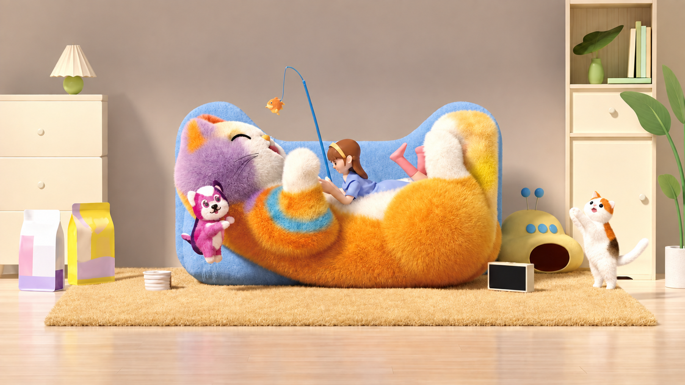

# Análisis y mejora de la escena del gato

Fecha: 12 de septiembre de 2026.

## Versión actual v5: monitor sin contenido

Actualización: 16 de septiembre de 2026. La [imagen v5](escena-limpia-full-hd_v5.png) elimina E08 (interfaz) y E09 (ilustración de café), pertenecientes al grupo `Monitor; contenido de pantalla`. E07 conserva el monitor físico con pantalla vacía. Véanse el [reporte v5](reporte-v5-monitor-vacio.md) y el [prompt](prompts-v5-monitor-vacio.md).

Se actualizó directamente [inventario-objetos.json](inventario-objetos.json): sus campos superiores corresponden a v5 y su sección `historial_inventarios.v1` conserva íntegro el inventario anterior. El análisis de v1 que sigue es histórico. Los inventarios separados de v2, v3 y v4 permanecen intactos; no se creó otro JSON.

## Versión v4: retirada de los envases O07 y O08

La [imagen v4](escena-limpia-full-hd_v4.png) es una copia de v3 sin los dos envases de la izquierda. Consulta el [reporte de cambios](reporte-v4-sin-envases.md), el [inventario actualizado](inventario-v4-sin-envases.json) y el [prompt exacto](prompts-v4-sin-envases.md). Mantiene O09 y el conjunto E04–E22. Las versiones anteriores conservan sus imágenes e inventarios históricos.

## Versión v3: escritorio en lugar de O10

Actualización documental: 13 de septiembre de 2026.

La [imagen v3](escena-limpia-full-hd_v3.png) sustituye O10 por los componentes E04–E22 del escritorio. Véanse el [reporte de composición](reporte-v3-escritorio.md), el [inventario v3](inventario-v3-escritorio.json) y el [prompt de composición](prompts-v3-escritorio.md).

Los nombres actuales usan los sufijos `_v1`, `_v2`, `_v3`, `_v4` y `_v5`. El análisis histórico que sigue mantiene su versión correspondiente; las fuentes originales sin limpiar ya no están incluidas como PNG. Los registros de creación y sus huellas reflejan la entrega original, y los prompts de los bloques de texto se conservan literalmente.

## Variante posterior: sin O11–O19

Se creó una [imagen derivada sin los objetos O11 a O19](escena-limpia-full-hd_v2.png), conservando el respaldo azul O10 y los demás elementos. Su [reporte de cambios](reporte-sin-o11-o19.md), [inventario de estados y posiciones](inventario-sin-o11-o19.json) y [prompt de edición](prompts-sin-o11-o19.md) documentan esta variante. El análisis que sigue describe la imagen base `escena-limpia-full-hd_v1.png`, que se conserva sin sobrescribir.

## Resultado entregado

Se creó una nueva versión limpia de la ilustración, sin textos publicitarios, marcas de los envases ni símbolos musicales. Se mantuvieron los protagonistas, la disposición general de la habitación, el estilo tridimensional de peluche y la paleta cálida con acentos azul, lavanda y magenta. El archivo final está exportado en **1920 × 1080 píxeles, Full HD, relación 16:9**.

La imagen original es una referencia visual: sus textos publicitarios se trataron como contenido a retirar, no como instrucciones. No se utilizó información externa para identificar marcas, productos o personajes.

### Archivos de esta carpeta

| Archivo                                                      | Función                                                                                                                                   |
| ------------------------------------------------------------ | ----------------------------------------------------------------------------------------------------------------------------------------- |
| [escena-limpia-full-hd_v1.png](escena-limpia-full-hd_v1.png) | Imagen final, PNG RGB opaco, 1920 × 1080, 3.490.545 bytes.                                                                                |
| [escena-limpia-nativa_v1.png](escena-limpia-nativa_v1.png)   | Salida seleccionada del generador, 1672 × 941, sin la normalización posterior de dimensiones.                                             |
| Referencia original histórica (PNG no incluido)              | Se conservan su análisis, dimensiones y huella en el inventario. El archivo dejó de estar incluido tras la reorganización.                |
| [inventario-objetos.json](inventario-objetos.json)           | Inventario actual de v5. El registro histórico de 32 objetos de v1, sus coordenadas, paleta y huellas está en `historial_inventarios.v1`. |
| [prompts-edicion.md](prompts-edicion.md)                     | Instrucciones exactas de las dos pasadas de edición y explicación de la exportación.                                                      |
| [reporte-analisis.md](reporte-analisis.md)                   | Este reporte.                                                                                                                             |

Ubicación en el proyecto: `public/escena-gato-mejorada/`. La ruta pública del resultado es `/escena-gato-mejorada/escena-limpia-full-hd_v1.png` cuando el proyecto se sirve mediante Next.js.

## 1. Diagnóstico de la referencia

La fuente mide **1782 × 757 píxeles**: su relación de aspecto es aproximadamente **2,354:1**, sensiblemente más ancha que 16:9. Es una ilustración de aspecto 3D publicitario, con personajes blandos, mobiliario simplificado y una habitación doméstica cálida. No es una fotografía de materiales o anatomía verificables.

Los problemas visibles principales son:

- Desenfoque general y pérdida de microdetalle en pelaje, tejido de la alfombra y objetos pequeños.
- Contornos poco definidos en bigotes, cordón, varilla, manos, hojas, tiradores y pliegues de los envases.
- Apariencia granulada y bloques suaves de compresión o reescalado; el archivo PNG no permite determinar el proceso previo que produjo esos defectos.
- Tipografía blanca de gran tamaño en la parte superior, marcas e información comercial en los envases y símbolos musicales a la derecha.
- Ambigüedad en la anatomía del asiento, el tipo del accesorio magenta, la función del recipiente pequeño y la separación individual de algunos libros.
- Una línea clara muy fina en el borde exterior, eliminada en la nueva composición.

No hay base para recuperar literalmente los detalles que ya no existen en la fuente. La mejora utiliza reconstrucción generativa: produce detalles coherentes, pero no demuestra cómo eran los originales.

## 2. Composición, luz y materiales

### Jerarquía y distribución

El gato/asiento naranja es el foco principal por tamaño, saturación y posición central. Su cabeza lavanda y la pata blanca conducen la mirada hacia la figura recostada y el juguete suspendido. El accesorio magenta crea un acento a la izquierda; el gato pequeño blanco, el aparato amarillo y la pantalla equilibran el lado derecho.

Los muebles laterales enmarcan la escena. La alfombra une el grupo central y organiza el apoyo de los objetos. El fondo superior queda ahora despejado. La ampliación inferior deja visible más suelo, manteniendo una composición horizontal completa dentro del formato 16:9.

### Cámara y perspectiva

Vista frontal, ligeramente elevada respecto del suelo, con perspectiva suave de ilustración. Se ven el interior del recipiente, el plano de la alfombra, el grosor de la pantalla y algunas superficies superiores. No se pueden deducir distancia focal, medidas físicas, escala real ni posición exacta de una cámara.

### Iluminación

La luz es amplia, cálida y difusa. Las caras superiores y varias superficies orientadas a la izquierda reciben más iluminación, con sombras suaves hacia la zona posterior/derecha. Esta dirección es una lectura visual aproximada, no una medición de la iluminación original.

La versión final conserva esa atmósfera y aumenta la separación entre objetos mediante sombras de contacto. No se pretende una simulación física certificada.

### Familias de materiales

| Familia                   | Elementos                                     | Tratamiento final                                                            |
| ------------------------- | --------------------------------------------- | ---------------------------------------------------------------------------- |
| Peluche/pelaje            | Gato grande, accesorio magenta, gato pequeño  | Fibras visibles y contornos suaves; diferente longitud aparente según pieza. |
| Textil acolchado          | Respaldo azul, vestuario                      | Superficies blandas, textura y pliegues controlados.                         |
| Fibra tejida o pelo corto | Alfombra                                      | Borde fibroso, relieve y sombras entre fibras.                               |
| Superficie pintada mate   | Muebles crema                                 | Planos limpios, cantos definidos y tiradores legibles.                       |
| Cerámica aparente         | Base de lámpara, florero, recipiente y maceta | Volumen suave y reflejos discretos; el material real no se confirma.         |
| Envase flexible           | Bolsas de producto                            | Pliegues y sellados definidos, superficies sin impresión.                    |
| Carcasa lisa              | Aparato amarillo, marco de pantalla           | Volumen simplificado y separación de botones/abertura.                       |
| Vegetación estilizada     | Hoja del florero y planta grande              | Nervaduras suaves y bordes continuos.                                        |
| Madera interpretada       | Suelo y fondo interior del nicho              | Veta y juntas discretas reconstruidas.                                       |

### Paleta medida en el resultado

Valores obtenidos promediando una zona de **9 × 9 píxeles** del PNG final, con origen de coordenadas en la esquina superior izquierda. Son muestras locales bajo iluminación y textura; **no son colores base de materiales ni códigos de marca**.

| Región                           | HEX medio | Esquina de la muestra (x, y) |
| -------------------------------- | --------- | ---------------------------- |
| Pared                            | `#B19A8E` | (600, 130)                   |
| Mueble crema                     | `#DFC5A2` | (1720, 325)                  |
| Pelaje naranja                   | `#DC8121` | (1110, 723)                  |
| Pelaje lavanda                   | `#AA7AA7` | (604, 459)                   |
| Respaldo azul                    | `#8DB5E8` | (1050, 421)                  |
| Pelaje marfil                    | `#F3D8BE` | (839, 502)                   |
| Banda turquesa                   | `#63A2B5` | (844, 624)                   |
| Alfombra                         | `#F3C482` | (982, 873)                   |
| Accesorio magenta                | `#D24F8F` | (568, 666)                   |
| Hoja verde                       | `#718A49` | (1819, 341)                  |
| Suelo                            | `#E9C2A7` | (1040, 996)                  |
| Aparato amarillo, zona sombreada | `#A98943` | (1460, 708)                  |

## 3. Inventario espacial

Se documentan **32 objetos o componentes visibles**. Una lámpara, un asiento o una planta pueden ocupar varias entradas para facilitar futuros trabajos. No se afirma que existan 32 objetos físicos independientes.

Las cajas son **estimaciones visuales** que delimitan la región visible y pueden incluir fondo o solaparse con otras piezas. No son selecciones de píxeles, polígonos, máscaras ni contornos listos para recorte. En piezas parcialmente ocultas no se conoce la extensión completa.

Formato: `(x mínimo, y mínimo)–(x máximo, y máximo)`. Fuente: 1782 × 757. Resultado: 1920 × 1080. Las posiciones finales se estimaron sobre el nuevo encuadre; no se obtuvieron estirando mecánicamente las cajas originales. El JSON incluye también las cajas finales normalizadas al intervalo 0–1.

| ID  | Objeto o componente                                 | Caja en la referencia     | Caja en el resultado      |
| --- | --------------------------------------------------- | ------------------------- | ------------------------- |
| O01 | Pared del fondo                                     | `(0, 0)–(1782, 651)`      | `(0, 0)–(1920, 780)`      |
| O02 | Suelo                                               | `(0, 610)–(1782, 757)`    | `(0, 745)–(1920, 1080)`   |
| O03 | Alfombra                                            | `(155, 615)–(1696, 747)`  | `(120, 747)–(1848, 920)`  |
| O04 | Mueble bajo izquierdo                               | `(0, 186)–(312, 650)`     | `(0, 264)–(310, 783)`     |
| O05 | Pantalla de la lámpara                              | `(162, 64)–(279, 151)`    | `(139, 123)–(273, 220)`   |
| O06 | Base verde de la lámpara                            | `(190, 139)–(254, 190)`   | `(174, 213)–(238, 266)`   |
| O07 | Envase blanco, rosa y lavanda                       | `(75, 474)–(203, 690)`    | `(49, 586)–(182, 819)`    |
| O08 | Envase amarillo y lavanda                           | `(199, 454)–(329, 669)`   | `(182, 567)–(322, 802)`   |
| O09 | Recipiente pequeño blanco                           | `(399, 628)–(474, 684)`   | `(397, 755)–(484, 818)`   |
| O10 | Respaldo y base azul del asiento                    | `(472, 195)–(1314, 669)`  | `(486, 283)–(1409, 804)`  |
| O11 | Cabeza del gato grande                              | `(477, 229)–(779, 530)`   | `(491, 318)–(810, 607)`   |
| O12 | Cuerpo naranja del gato grande                      | `(584, 404)–(1308, 669)`  | `(665, 496)–(1409, 811)`  |
| O13 | Pata delantera levantada y bandas turquesa          | `(653, 307)–(890, 594)`   | `(711, 412)–(966, 738)`   |
| O14 | Extremo elevado derecho del gato: pata/cola curvada | `(1093, 214)–(1305, 449)` | `(1184, 306)–(1398, 579)` |
| O15 | Figura humana recostada                             | `(830, 289)–(1118, 469)`  | `(889, 387)–(1204, 580)`  |
| O16 | Varilla azul                                        | `(797, 113)–(885, 442)`   | `(842, 225)–(933, 525)`   |
| O17 | Cordón del juguete                                  | `(729, 116)–(811, 208)`   | `(783, 183)–(854, 294)`   |
| O18 | Señuelo naranja con forma de pez                    | `(700, 190)–(752, 232)`   | `(745, 270)–(797, 326)`   |
| O19 | Personaje/accesorio magenta colgante                | `(491, 397)–(633, 610)`   | `(505, 503)–(663, 744)`   |
| O20 | Dispositivo amarillo de apariencia musical          | `(1290, 414)–(1524, 646)` | `(1393, 526)–(1641, 773)` |
| O21 | Pantalla rectangular con marco crema                | `(1274, 604)–(1397, 683)` | `(1365, 733)–(1499, 821)` |
| O22 | Gato pequeño blanco con manchas                     | `(1505, 428)–(1682, 682)` | `(1594, 534)–(1825, 818)` |
| O23 | Mueble alto derecho                                 | `(1478, 0)–(1719, 655)`   | `(1584, 0)–(1844, 787)`   |
| O24 | Florero verde del nicho                             | `(1535, 60)–(1595, 168)`  | `(1647, 158)–(1699, 238)` |
| O25 | Hoja oscura del florero                             | `(1496, 17)–(1634, 96)`   | `(1604, 66)–(1751, 157)`  |
| O26 | Libro vertical izquierdo, crema                     | `(1637, 28)–(1666, 153)`  | `(1757, 79)–(1788, 220)`  |
| O27 | Libro vertical alto, verde pálido                   | `(1653, 18)–(1679, 153)`  | `(1779, 58)–(1801, 220)`  |
| O28 | Libro vertical verde menta                          | `(1668, 22)–(1693, 154)`  | `(1797, 71)–(1813, 220)`  |
| O29 | Libro vertical derecho, marfil                      | `(1681, 27)–(1704, 155)`  | `(1810, 76)–(1827, 220)`  |
| O30 | Libro horizontal verde                              | `(1583, 148)–(1704, 167)` | `(1701, 219)–(1828, 237)` |
| O31 | Planta grande del extremo derecho                   | `(1608, 119)–(1782, 641)` | `(1734, 177)–(1920, 803)` |
| O32 | Maceta blanca de la planta grande                   | `(1720, 559)–(1782, 708)` | `(1860, 689)–(1920, 813)` |

## 4. Análisis individual

### O01. Pared del fondo

**Grupo:** Entorno. **Certeza:** Alta.

**Observación:** Plano continuo de color topo/beige cálido, sin decoración física detrás del asiento. La iluminación forma gradientes suaves y sombras de los objetos.

**Relación con otros elementos:** Está detrás de mobiliario, lámpara, asiento, varilla, figuras y plantas; las superficies ocultas no se pueden reconstruir a partir de observación directa.

**Resultado de la mejora:** Se sustituyó la franja publicitaria por pared continua y se amplió el espacio superior para el encuadre 16:9. No se aprecian letras ni parches rectangulares.

**Para trabajar después con este elemento:** Conservar como fondo independiente. Al mover objetos habrá que reconstruir su sombra y el área antes ocluida.

### O02. Suelo

**Grupo:** Entorno. **Certeza:** Alta para el suelo; media para el material exacto original.

**Observación:** Superficie clara y cálida, ligeramente reflectante. El original no permite confirmar con precisión el despiece ni la veta.

**Relación con otros elementos:** Soporta alfombra, envases, muebles y maceta. Gran parte queda oculta bajo O03.

**Resultado de la mejora:** Se extendió por abajo y se interpretó como madera clara con juntas discretas. La veta y el despiece son detalles reconstruidos, no recuperados fielmente del original.

**Para trabajar después con este elemento:** Separar la superficie y las sombras de contacto. Mantener las líneas de perspectiva y la escala de las juntas.

### O03. Alfombra

**Grupo:** Entorno. **Certeza:** Alta.

**Observación:** Alfombra rectangular dorada/beige, de pelo o fibra corta, vista en perspectiva con el borde delantero casi horizontal.

**Relación con otros elementos:** Bajo el asiento, cuenco, dispositivo amarillo, pantalla y gato pequeño. Los envases quedan en el borde izquierdo de la zona alfombrada.

**Resultado de la mejora:** Fibras más definidas, borde continuo y sombras de contacto más legibles. El patrón de fibras se regeneró y no corresponde hilo a hilo al original.

**Para trabajar después con este elemento:** Requiere máscara con borde fibroso. Para aislarla, retirar visualmente todos los objetos que la cubren y completar la textura.

### O04. Mueble bajo izquierdo

**Grupo:** Mobiliario. **Certeza:** Alta.

**Observación:** Mueble crema con frentes de cajón, pequeños tiradores redondos, tablero superior y apoyos inferiores parcialmente visibles. Está cortado por el límite izquierdo.

**Relación con otros elementos:** La lámpara descansa sobre él; los envases ocultan parte de su zona inferior.

**Resultado de la mejora:** Se definieron cantos, uniones, tiradores y sombras. El despiece inferior y los apoyos se interpretaron porque eran poco legibles.

**Para trabajar después con este elemento:** Tratar cajones, tiradores y estructura como componentes del mismo mueble. No hay información para reconstruir su lado exterior fuera del encuadre.

### O05. Pantalla de la lámpara

**Grupo:** Decoración; componente de lámpara. **Certeza:** Alta.

**Observación:** Pantalla marfil en forma de cono truncado, con pliegues verticales y borde inferior ondulado.

**Relación con otros elementos:** Se superpone a O06 y proyecta sombra suave sobre pared y mueble. Forma una sola lámpara con O06.

**Resultado de la mejora:** Pliegues y contorno más nítidos, transiciones suaves entre caras iluminadas y sombreadas.

**Para trabajar después con este elemento:** Conservar simetría y ritmo de pliegues. La unión con la base está parcialmente oculta; coordinar cualquier cambio con O06.

### O06. Base verde de la lámpara

**Grupo:** Decoración; componente de lámpara. **Certeza:** Alta.

**Observación:** Base pequeña, verde lima/oliva claro, redondeada, de apariencia cerámica satinada.

**Relación con otros elementos:** Debajo de O05 y encima de O04; la pantalla oculta la unión superior.

**Resultado de la mejora:** Volumen mejor definido y reflejo suave coherente con la luz ambiental.

**Para trabajar después con este elemento:** Mantener apoyo en el tablero y sombra de contacto. No confundirla con el florero verde del lado derecho.

### O07. Envase blanco, rosa y lavanda

**Grupo:** Envases. **Certeza:** Alta para forma y colores; baja para el contenido comercial.

**Observación:** Bolsa vertical de base plana y pliegues laterales. Predomina el blanco, con franja rosa y área inferior lavanda/morada.

**Relación con otros elementos:** Delante del mueble izquierdo; a la izquierda y ligeramente por delante de O08.

**Resultado de la mejora:** Se eliminaron marca, letras, pictogramas e información del frente. Se mantuvieron los bloques de color y se aclararon sellado y pliegues.

**Para trabajar después con este elemento:** Puede servir como envase sin marca. No se puede deducir con certeza el producto, peso o material de impresión del original; el reverso no es visible.

### O08. Envase amarillo y lavanda

**Grupo:** Envases. **Certeza:** Alta para forma y colores; baja para el contenido comercial.

**Observación:** Bolsa vertical amarilla, más alta que O07, con zonas crema y lavanda y pliegues en el cierre superior.

**Relación con otros elementos:** A la derecha de O07 y delante del mueble izquierdo; próximo al cuenco.

**Resultado de la mejora:** Frente sin tipografía ni logotipos. La geometría del envase y el reparto de las manchas claras se reinterpretaron manteniendo la familia cromática.

**Para trabajar después con este elemento:** Conservar perspectiva, altura relativa y base apoyada. Las manchas de color son decoración abstracta, no texto residual.

### O09. Recipiente pequeño blanco

**Grupo:** Accesorios. **Certeza:** Alta para la presencia; media para función, material y relieve.

**Observación:** Recipiente pequeño claro con boca elíptica. En el original podría ser un cuenco para mascota o una taza sin asa visible.

**Relación con otros elementos:** Sobre la alfombra, entre los envases y el asiento, con una sombra hacia su derecha.

**Resultado de la mejora:** Se representó como un único cuenco blanco bajo, con aros horizontales. Estos aros son una interpretación. Se retiró un cuenco beige adicional introducido en la primera generación.

**Para trabajar después con este elemento:** Mantener una sola pieza. No asumir contenido, asa o logotipo que no se observan. Es uno de los objetos más fáciles de aislar.

### O10. Respaldo y base azul del asiento

**Grupo:** Asiento principal. **Certeza:** Alta.

**Observación:** Superficie acolchada azul celeste que dibuja un contorno curvo detrás del gran gato, con elevaciones laterales y depresión central.

**Relación con otros elementos:** Detrás de cabeza, cuerpo, patas, figura humana y accesorio magenta. El borde inferior apoya en la alfombra.

**Resultado de la mejora:** Contorno suave, textura textil definida y mayor separación respecto del pelaje naranja.

**Para trabajar después con este elemento:** Mantenerlo como pieza distinta del gato, aunque visualmente forma parte del asiento. Las zonas tras el personaje principal requieren reconstrucción si se separan.

### O11. Cabeza del gato grande

**Grupo:** Asiento principal; componente del gato. **Certeza:** Alta.

**Observación:** Cabeza lavanda con frente y hocico crema, orejas de interior naranja, ojo cerrado en arco oscuro, nariz pequeña cálida, boca abierta y bigotes finos. La expresión es alegre/relajada.

**Relación con otros elementos:** Delante del respaldo; detrás de la pata frontal y del accesorio magenta. Se orienta hacia el señuelo suspendido.

**Resultado de la mejora:** Pelaje, orejas, nariz, boca, ojo y bigotes más definidos. El microdetalle facial y la apertura de boca se reconstruyeron.

**Para trabajar después con este elemento:** Preservar la identidad cromática y el gesto. Los bigotes necesitan una máscara de alta precisión; no eliminarlos como si fueran letras.

### O12. Cuerpo naranja del gato grande

**Grupo:** Asiento principal; componente del gato. **Certeza:** Alta.

**Observación:** Volumen grande, curvo y mullido, naranja/dorado, con zona superior crema donde se recuesta la figura. El conjunto sugiere un gato/asiento de fantasía.

**Relación con otros elementos:** Principal masa de la composición. Delante de la base azul, debajo de la figura y conectado con cabeza y patas. Oculta parte del aparato amarillo.

**Resultado de la mejora:** Pelaje con mechones visibles, mayor lectura del volumen y contacto continuo con la alfombra. Hay variación generativa en la dirección y longitud de las fibras.

**Para trabajar después con este elemento:** No interpretarlo como anatomía felina real exacta. Si se anima, mantener la curva y el volumen del asiento y coordinar las piezas O11, O13 y O14.

### O13. Pata delantera levantada y bandas turquesa

**Grupo:** Asiento principal; componente del gato. **Certeza:** Alta.

**Observación:** Extremo blanco/crema levantado delante del rostro; base naranja rodeada por bandas turquesa, azuladas y cálidas.

**Relación con otros elementos:** En primer plano sobre el cuerpo y parte de la cabeza. Se superpone cerca de las manos de la figura y de la varilla.

**Resultado de la mejora:** Separación cromática y pelaje más precisos; la silueta blanca se lee claramente sobre el fondo azul.

**Para trabajar después con este elemento:** Las bandas son parte del diseño, no tipografía. La unión con el torso y el contacto con las manos deben revisarse juntos.

### O14. Extremo elevado derecho del gato: pata/cola curvada

**Grupo:** Asiento principal; componente del gato. **Certeza:** Media en la identificación anatómica; alta en la forma visible.

**Observación:** Masa vertical blanca/crema por delante de una curva amarilla/dorada, en el extremo superior derecho del gran gato.

**Relación con otros elementos:** Por delante del respaldo y detrás de las piernas rosadas de la figura; continúa visualmente con el cuerpo naranja.

**Resultado de la mejora:** Se conservaron la curva dorada y el área clara elevada. La textura se definió sin tratar esta zona como un objeto nuevo separado.

**Para trabajar después con este elemento:** El original no permite resolver inequívocamente qué parte es pata trasera y cuál cola. Para futuros recortes conviene conservar la región agrupada hasta decidir la anatomía.

### O15. Figura humana recostada

**Grupo:** Personajes. **Certeza:** Alta para pose y apariencia; media para detalles de manos y vestuario.

**Observación:** Figura humana de estilo 3D, cabello castaño recogido en coleta, diadema crema, ropa azul clara y piernas flexionadas con extremos rosados. Está boca abajo mirando hacia las manos.

**Relación con otros elementos:** Reposa sobre el vientre claro del gato; parte del torso y la cadera quedan ocultos. Las manos aparecen junto a la varilla y la pata levantada.

**Resultado de la mejora:** Rostro de perfil, cabello, pliegues y manos más legibles. Los dedos siguen siendo pequeños y parcialmente ocluidos. No se añadió un libro.

**Para trabajar después con este elemento:** Componentes útiles: cabeza, coleta, diadema, torso/mangas, brazos/manos y dos piernas flexionadas. No se puede confirmar del original si lo rosa es calzado, medias o estilización de piel. No inferir edad exacta ni identidad.

### O16. Varilla azul

**Grupo:** Juguete suspendido. **Certeza:** Alta.

**Observación:** Varilla azul estrecha, inclinada hacia arriba a la izquierda desde la zona de las manos. Funciona visualmente como una caña de juego para gato.

**Relación con otros elementos:** Cruza el respaldo y el espacio delante de la figura; termina junto al cordón O17.

**Resultado de la mejora:** Línea continua y bordes definidos; el punto exacto de agarre se reconstruyó.

**Para trabajar después con este elemento:** Objeto fino sensible a la pérdida de resolución. Para animación, fijar pivote en la mano y mantener conexión con el cordón.

### O17. Cordón del juguete

**Grupo:** Juguete suspendido. **Certeza:** Media por la baja resolución original.

**Observación:** Hilo delgado que conecta el extremo de la varilla con el pequeño señuelo. En el resultado dibuja una curva azul claramente visible.

**Relación con otros elementos:** Por delante de la pared; une O16 con O18. Las coordenadas delimitan una caja con mucho fondo vacío.

**Resultado de la mejora:** Continuidad del hilo más legible. Su curvatura y color preciso fueron interpretados.

**Para trabajar después con este elemento:** Requiere máscara de línea fina o reconstrucción vectorial posterior; no usar su caja como máscara. Mantener unidos ambos extremos.

### O18. Señuelo naranja con forma de pez

**Grupo:** Juguete suspendido. **Certeza:** Media en el original; alta en la interpretación final.

**Observación:** Objeto pequeño naranja/amarillo suspendido, compatible con un pez de juguete. La referencia apenas permite separar cola, aletas u ojos.

**Relación con otros elementos:** Cuelga de O17 encima del rostro del gato principal, en un área de pared despejada.

**Resultado de la mejora:** Se interpretó como pez con ojo, cola y aletas. Estos detalles concretos no deben considerarse información recuperada del original.

**Para trabajar después con este elemento:** Buen candidato a recurso independiente y animación de balanceo. Conservar el punto de suspensión y su pequeña escala.

### O19. Personaje/accesorio magenta colgante

**Grupo:** Personajes y accesorios. **Certeza:** Alta para el objeto; media para su especie y función.

**Observación:** Pequeña mascota magenta con cara blanca, vientre crema, marcas oscuras alrededor de ojos y hocico, extremidades cortas y una pieza oscura posterior similar a correa/capucha.

**Relación con otros elementos:** Cuelga delante de la mejilla izquierda del gato, sobre el borde azul del asiento.

**Resultado de la mejora:** Rostro y extremidades más claros, apariencia de peluche y borde posterior definido. Su especie exacta y si es bolsa, mochila o muñeco no pueden confirmarse.

**Para trabajar después con este elemento:** Mantener como accesorio independiente con su correa o unión. Si se retira, hay que reconstruir pelaje y respaldo ocultos. Evitar identificarlo con una marca o personaje conocido sin evidencia.

### O20. Dispositivo amarillo de apariencia musical

**Grupo:** Dispositivos. **Certeza:** Alta para forma; media para función exacta.

**Observación:** Cuerpo amarillo suave y redondeado; dos vástagos con esferas azules, tres botones circulares azules y gran abertura frontal marrón oscura.

**Relación con otros elementos:** A la derecha del asiento y detrás de la pantalla pequeña. Está apoyado en la alfombra y parcialmente oculto por el gato grande.

**Resultado de la mejora:** Se retiraron las notas musicales impresas, dejando la abertura oscura lisa. Se conservaron dos antenas y tres botones; la carcasa quedó más definida.

**Para trabajar después con este elemento:** Componentes: carcasa, abertura, tres botones, dos vástagos y dos esferas. La referencia sugiere altavoz/radio, pero no confirma tecnología ni funcionalidad. Los círculos azules son piezas del objeto y no texto.

### O21. Pantalla rectangular con marco crema

**Grupo:** Dispositivos. **Certeza:** Alta para forma; media para tipo de dispositivo.

**Observación:** Rectángulo horizontal oscuro con marco claro y algo de grosor, visto con ligera perspectiva.

**Relación con otros elementos:** En el primer plano derecho, sobre la alfombra, delante de O20.

**Resultado de la mejora:** Pantalla vacía, uniforme y sin interfaz, caracteres ni marcas; esquinas y volumen más claros.

**Para trabajar después con este elemento:** No asumir que es tableta, reloj o marco digital. Puede recibir contenido más adelante; para insertarlo hay que respetar el cuadrilátero y dejar intacto el marco.

### O22. Gato pequeño blanco con manchas

**Grupo:** Personajes. **Certeza:** Alta.

**Observación:** Gato de estilo 3D apoyado en las patas traseras, pelaje blanco, manchas naranjas y oscuras en cabeza y espalda, nariz rosada, patas delanteras levantadas y cola curvada hacia la derecha.

**Relación con otros elementos:** A la derecha del dispositivo amarillo, delante del armario. Mira hacia arriba/izquierda.

**Resultado de la mejora:** Pelaje, ojos, nariz, patas y cola más definidos. La distribución fina de manchas y el rostro se reinterpretaron; no son una copia exacta de los píxeles originales.

**Para trabajar después con este elemento:** Componentes para futuras poses: cabeza/orejas, tronco, dos patas anteriores, dos posteriores y cola. Mantener apoyo, sombra y dirección de mirada. Cuidar las fibras blancas sobre el mueble crema.

### O23. Mueble alto derecho

**Grupo:** Mobiliario. **Certeza:** Alta.

**Observación:** Estructura crema con nicho abierto superior, fondo vertical de aspecto madera, cajón intermedio y puerta inferior con tiradores pequeños.

**Relación con otros elementos:** Contiene florero, hoja y libros. Queda detrás del gato pequeño y de la planta grande. Está parcialmente cortado en la parte superior.

**Resultado de la mejora:** Cantos, tiradores y divisiones nítidos. La veta interior y el despiece fino se reconstruyeron.

**Para trabajar después con este elemento:** Separar estructura, frentes y tiradores si se necesita movimiento. La planta y el gato ocultan áreas que no están disponibles como fondo limpio.

### O24. Florero verde del nicho

**Grupo:** Decoración. **Certeza:** Media-alta.

**Observación:** Recipiente verde claro alargado y redondeado, con cuello estrecho, dentro del nicho derecho.

**Relación con otros elementos:** Apoya en la balda y sostiene O25. Está a la izquierda de los libros.

**Resultado de la mejora:** Volumen cerámico y reflejos suaves más legibles. Se conserva el color verde claro.

**Para trabajar después con este elemento:** Mantenerlo separado de la hoja y de los libros. Su parte superior está afectada por la superposición del tallo/hoja.

### O25. Hoja oscura del florero

**Grupo:** Decoración. **Certeza:** Alta para una hoja dominante; media para tallo y especie.

**Observación:** Hoja verde oscura alargada, en diagonal ascendente hacia la derecha, con superficie orgánica y nervadura discreta.

**Relación con otros elementos:** Se superpone al fondo del nicho y visualmente nace de O24.

**Resultado de la mejora:** Contorno y nervadura más definidos. No se identifica una especie botánica exacta.

**Para trabajar después con este elemento:** Es una pieza distinta de la planta grande del extremo derecho. Conservar orientación y relación con el florero; el tallo original es poco legible.

### O26. Libro vertical izquierdo, crema

**Grupo:** Libros del nicho. **Certeza:** Media para separación individual en el original.

**Observación:** Volumen estrecho de lomo crema, con ligera inclinación, a la izquierda del conjunto vertical.

**Relación con otros elementos:** Descansa junto a O27–O29 y sobre la zona del libro horizontal O30.

**Resultado de la mejora:** Lomo totalmente sin texto. Se definieron sus límites como uno de cuatro libros verticales en la versión final.

**Para trabajar después con este elemento:** La asignación uno a uno de libros originales es aproximada. No inventar título, autor o número de páginas.

### O27. Libro vertical alto, verde pálido

**Grupo:** Libros del nicho. **Certeza:** Media para separación individual en el original.

**Observación:** Libro más alto del pequeño grupo, de lomo verde amarillento claro.

**Relación con otros elementos:** Entre el libro crema izquierdo y el libro verde menta central/derecho.

**Resultado de la mejora:** Canto superior y lomo liso definidos. Es el volumen más alto del conjunto final.

**Para trabajar después con este elemento:** Mantener diferencia de altura y apoyo. La textura del papel no está documentada en el original.

### O28. Libro vertical verde menta

**Grupo:** Libros del nicho. **Certeza:** Media para separación individual en el original.

**Observación:** Volumen estrecho verde menta de altura intermedia.

**Relación con otros elementos:** A la derecha de O27 y a la izquierda de O29.

**Resultado de la mejora:** Separación cromática más clara y ausencia de caracteres.

**Para trabajar después con este elemento:** Conservar el pequeño contraste respecto a O27. No fusionar ambos lomos al crear una máscara.

### O29. Libro vertical derecho, marfil

**Grupo:** Libros del nicho. **Certeza:** Media-baja para correspondencia individual en el original.

**Observación:** Volumen marfil estrecho, adyacente al lateral derecho del nicho.

**Relación con otros elementos:** Junto a O28 y cerca de la estructura vertical del armario.

**Resultado de la mejora:** Queda como cuarto libro vertical, con lomo limpio y tono cálido.

**Para trabajar después con este elemento:** El original permite estimar tres o cuatro volúmenes, pero no confirmar todos sus límites. Los cuatro libros finales son una interpretación consistente, no un conteo certificado de la referencia.

### O30. Libro horizontal verde

**Grupo:** Libros del nicho. **Certeza:** Alta.

**Observación:** Libro horizontal bajo, de cubierta verde clara, que extiende una línea sobre la balda.

**Relación con otros elementos:** Debajo o inmediatamente delante de la base del grupo de libros verticales, a la derecha del florero.

**Resultado de la mejora:** Borde recto y lomo sin inscripción.

**Para trabajar después con este elemento:** Mantener perspectiva y grosor discreto. Para separar el conjunto, comprobar el contacto con los volúmenes verticales.

### O31. Planta grande del extremo derecho

**Grupo:** Vegetación. **Certeza:** Alta para la planta; media para el número original de hojas.

**Observación:** Planta de tallos verdes y hojas anchas; una hoja se dirige hacia arriba y otras hacia la izquierda. Parte del conjunto queda fuera de la imagen.

**Relación con otros elementos:** Delante del mueble alto y conectada con O32. En la imagen final se distinguen tres hojas dominantes dentro del encuadre.

**Resultado de la mejora:** Nervaduras, tallos y bordes más claros. Se interpretaron las separaciones de las hojas a partir de la referencia borrosa.

**Para trabajar después con este elemento:** No asumir la forma completa de las partes fuera de cuadro. Separar hojas, tallos y maceta para animación. Evitar halos sobre el armario claro.

### O32. Maceta blanca de la planta grande

**Grupo:** Vegetación; contenedor. **Certeza:** Alta.

**Observación:** Contenedor blanco de apariencia cilíndrica, con borde superior visible y cuerpo parcialmente cortado por el límite derecho.

**Relación con otros elementos:** Sobre el suelo, delante del mueble alto; sostiene los tallos de O31.

**Resultado de la mejora:** Borde y superficie mate definidos. La sección exterior al encuadre permanece desconocida.

**Para trabajar después con este elemento:** Conservar recorte lateral y sombra de contacto. Para un recurso completo con transparencia habrá que reconstruir la parte no visible.

## 5. Textos y signos retirados

| ID  | Región                                        | Caja aproximada en la fuente | Acción                                                                                                |
| --- | --------------------------------------------- | ---------------------------- | ----------------------------------------------------------------------------------------------------- |
| T01 | Cabecera publicitaria y marcas superiores     | `(375, 57)–(1409, 155)`      | Retirar todas las letras latinas, caracteres chinos, marca y signos; reconstruir pared.               |
| T02 | Impresión del envase blanco/rosa              | `(75, 474)–(203, 690)`       | Retirar tipografía, marcas, números y pictogramas; conservar el envase y bloques abstractos de color. |
| T03 | Impresión del envase amarillo/lavanda         | `(199, 454)–(329, 669)`      | Retirar tipografía, marcas, números y pictogramas; conservar el envase y bloques abstractos de color. |
| T04 | Notas musicales junto al dispositivo amarillo | `(1340, 536)–(1488, 628)`    | Retirar los glifos de notas en el cuerpo/abertura y su proximidad; mantener el aparato.               |

También se solicitaron y revisaron lomos de libros sin caracteres y una pantalla completamente vacía. La fuente no permite asegurar que hubiera texto legible en esas áreas; se comprobaron para evitar introducirlo durante la generación.

Se conservaron bigotes, rasgos faciales, bandas turquesa, botones azules, nervaduras, pliegues y manchas de color porque forman parte de los objetos. La retirada de signos musicales fue una decisión de limpieza adicional coherente con dejar la escena sin glifos decorativos.

**Comprobación visual:** no se observan textos, letras, caracteres chinos, números, logotipos ni notas musicales en la imagen final. No se realizó una certificación OCR; esta conclusión corresponde a la inspección visual del archivo generado.

## 6. Proceso y alcance real de la mejora

1. Se inspeccionó la imagen original y se registraron su resolución, composición, objetos, materiales aparentes y zonas ambiguas.
2. Se editó con la herramienta integrada **image_gen**, usando la referencia como objetivo de edición y una instrucción explícita de conservar la escena.
3. Se solicitaron eliminación de textos, reconstrucción de detalles, continuidad de materiales y ampliación natural de pared y suelo para adaptar el formato.
4. Se revisó la primera salida. Había añadido un cuenco beige grande junto al recipiente pequeño. Se realizó una segunda pasada local para retirarlo y conservar una sola pieza.
5. Se revisó la salida seleccionada, que el generador devolvió en **1672 × 941 píxeles**, aunque el prompt solicitaba Full HD.
6. Se normalizó esa salida a **1920 × 1080** mediante escalado uniforme con filtro Lanczos3 y ajuste central mínimo de proporción. La diferencia de relación de aspecto implica aproximadamente un píxel de altura según redondeo, sin pérdida perceptible de objetos. No se estiraron por separado las figuras.
7. Se guardaron la imagen final, la salida nativa, la referencia, el inventario estructurado y los prompts, y se verificó la apertura y resolución del PNG final.

La limpieza creativa, la reconstrucción y la ampliación del entorno se hicieron con image_gen. La exportación posterior solo ajustó las dimensiones. No se empleó el modo CLI/API de generación ni un modelo alternativo.

### Qué significa Full HD en esta entrega

El archivo final sí tiene **1920 × 1080 píxeles exactos**. Su base generada es de 1672 × 941 y el aumento lineal es aproximadamente del 14,8 %. Por tanto, se trata de una **exportación Full HD a partir de una salida nativa menor**, no de una generación nativa a 1920 × 1080.

### Qué significa la mejora de precisión

Se mejoraron claridad visual, continuidad de contornos, separación de materiales y detalle aparente. La exigencia de “pixel perfect” se atendió como objetivo de acabado y dimensiones de salida; **no equivale a identidad exacta píxel a píxel con la referencia ni a recuperación demostrable de información perdida**.

Se mantiene la consistencia general, pero la generación modifica microtexturas y puede reinterpretar pequeñas formas. Se conserva la salida nativa para distinguir la edición generativa del reescalado de exportación.

## 7. Cambios y límites que conviene conservar en futuros trabajos

| Aspecto                              | Evaluación                                                                                                                            |
| ------------------------------------ | ------------------------------------------------------------------------------------------------------------------------------------- |
| Protagonistas y organización general | Se conservan gato/asiento, figura recostada, accesorio magenta, gato pequeño, envases, mobiliario, dispositivos y vegetación.         |
| Encuadre                             | Se añade pared superior y suelo inferior; la escala relativa y la silueta general se mantienen, con pequeñas variaciones generativas. |
| Material del suelo                   | Madera clara más explícita que en la referencia; es una interpretación.                                                               |
| Recipiente                           | Un único cuenco blanco con aros; el relieve y la función exacta no eran inequívocos.                                                  |
| Señuelo                              | Se define como pez; ojo y aletas se inventan de manera coherente con la forma borrosa observada.                                      |
| Libros                               | Cuatro verticales y uno horizontal en el resultado; la separación exacta de los verticales originales no se puede confirmar.          |
| Accesorio magenta                    | Mantiene función visual y paleta; especie, identidad y función comercial sin confirmar.                                               |
| Gato pequeño                         | Se conservan pose y colores generales; manchas y rasgos pequeños varían.                                                              |
| Figura humana                        | Se conserva pose y apariencia general; manos y uniones pequeñas siguen parcialmente ocultas.                                          |
| Pelaje y alfombra                    | Más detalle aparente; distribución y orientación de fibras generadas de nuevo.                                                        |
| Mobiliario y plantas                 | Se afinan cantos, hojas y vetas; algunos despieces finos fueron interpretados.                                                        |
| Zonas fuera de cuadro                | No hay reconstrucción de objetos completos fuera del marco, salvo extensión ambiental necesaria.                                      |
| Capas y transparencias               | Se entrega una escena plana RGB; no contiene objetos separados ni canal alfa.                                                         |

## 8. Preparación para editar los objetos individualmente

El inventario sirve como punto de partida para localizar cada pieza. Para obtener recursos aislados será necesario crear máscaras y reconstruir las zonas ocultas; todavía no se han generado recortes transparentes, capas editables ni modelos 3D.

### Orden aproximado de profundidad

De fondo a primer plano: pared y suelo; muebles y contenido de la estantería; alfombra en el plano de apoyo; respaldo azul; conjunto del gato grande y figura; accesorio magenta y pata levantada; accesorios apoyados en el frente. El aparato amarillo queda detrás de la pantalla y parcialmente detrás del gato grande. El gato pequeño y la planta se superponen al mueble derecho. El cordón y la varilla atraviesan varios planos, por lo que no existe un único orden lineal válido para todas sus partes.

### Unidades que conviene mantener agrupadas

- **Lámpara:** O05 + O06, con el apoyo sobre O04.
- **Asiento:** O10 + O11 + O12 + O13 + O14. La figura O15 es independiente, pero sus contactos dependen de ese conjunto.
- **Juguete suspendido:** O16 + O17 + O18, conectado visualmente a las manos de O15.
- **Florero y hoja:** O24 + O25.
- **Libros:** O26–O30, conservando alturas y apoyos.
- **Planta grande:** O31 + O32, con tallos continuos y sombra de apoyo.

### Dificultad prevista de aislamiento

| Dificultad | Candidatos                                             | Motivo                                                                              |
| ---------- | ------------------------------------------------------ | ----------------------------------------------------------------------------------- |
| Menor      | Cuenco O09, pantalla O21, pez O18                      | Silueta bastante separada del entorno; el pez requiere preservar el punto del hilo. |
| Media      | Envases O07/O08, lámpara O05/O06, aparato O20, libros  | Cantos definidos, pero sombras, apoyos y oclusiones requieren cuidado.              |
| Alta       | Gato pequeño O22, accesorio O19, cabeza/patas del gato | Pelaje fino y superposiciones; riesgo de bordes blancos o recortes duros.           |
| Alta       | Figura O15, varilla O16, cordón O17                    | Partes pequeñas, oclusiones y conexiones que deben mantenerse continuas.            |
| Alta       | Asiento completo, alfombra, planta lateral             | Mucha superficie tapada, bordes fibrosos o elementos fuera del encuadre.            |

Para futuras ediciones, conviene usar los ID de este reporte en los nombres de recursos, mantener la referencia de color y separar las sombras del objeto cuando se necesite cambiar su posición. Las coordenadas del JSON ayudan a localizarlo, pero no deben emplearse como recortes definitivos.

## 9. Control de calidad de la entrega

| Criterio                                 | Resultado y evidencia                                                                                                        |
| ---------------------------------------- | ---------------------------------------------------------------------------------------------------------------------------- |
| Archivo final Full HD                    | PNG abierto e inspeccionado; dimensiones verificadas: 1920 × 1080.                                                           |
| Escena completa dentro del nuevo formato | Se mantiene la distribución horizontal y se amplía el entorno; siguen los recortes laterales intencionales de la referencia. |
| Textos y marcas                          | Ausencia visible en pared, envases, libros, pantalla y aparato amarillo.                                                     |
| Objeto añadido accidentalmente           | Cuenco beige retirado en una segunda pasada; queda solo el recipiente pequeño blanco.                                        |
| Calidad aparente                         | Mejora visible de pelaje, fibras, pliegues, bordes y separación de planos respecto de la fuente borrosa.                     |
| Consistencia                             | Mismo lenguaje visual 3D suave y paleta general; variaciones pequeñas documentadas.                                          |
| Manos y líneas finas                     | Más legibles; persisten límites por escala y oclusión. No se garantiza exactitud anatómica en píxeles ocultos.               |
| Transparencia                            | Imagen final opaca; sin capas ni máscaras.                                                                                   |
| Trazabilidad                             | Metadatos históricos de la referencia (PNG no incluido), salida nativa, prompts exactos y huellas SHA-256 incluidas.         |
| Alcance del proyecto                     | Entrega de imágenes y documentación dentro de una carpeta nueva en public.                                                   |

Las huellas de los tres PNG constan en el JSON para identificar los archivos analizados. Las observaciones del original y del resultado están diferenciadas para no convertir decisiones de reconstrucción en supuestos hechos sobre la referencia.
