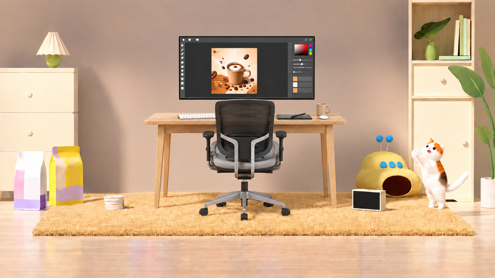

# Escena v3: escritorio en lugar del respaldo O10

Fecha: 13 de septiembre de 2026.

## Copia posterior v4: sin O07 y O08

La [imagen v4](escena-limpia-full-hd_v4.png) elimina los dos envases de la izquierda. El [reporte v4](reporte-v4-sin-envases.md), el [inventario v4](inventario-v4-sin-envases.json) y el [prompt v4](prompts-v4-sin-envases.md) documentan el cambio. Este archivo conserva la descripción de la v3, donde ambos envases siguen presentes; O09 y los componentes del monitor E07/E08 se mantienen en las dos versiones.

## Resultado

Se creó una copia derivada de [escena-limpia-full-hd_v2.png](escena-limpia-full-hd_v2.png) y se sustituyó por completo el respaldo/base azul **O10** por el conjunto de trabajo de la [imagen del escritorio](../escena-escritorio/escritorio-limpio-full-hd.png).

La v3 contiene un escritorio de madera, un monitor con interfaz gráfica e ilustración de café, una silla vacía y los accesorios de la mesa. La alfombra dorada, los muebles laterales, envases, cuenco, dispositivo amarillo, pantalla pequeña, gato blanco/manchado y vegetación pertenecen a la habitación base y se conservan.

El archivo final está exportado a **1920 × 1080 píxeles, Full HD, PNG RGB opaco**. Las versiones v1, v2 y la imagen donante permanecen como archivos independientes sin cambios en sus imágenes.

## Archivos y fuentes

| Función                                 | Archivo                                                                                       |
| --------------------------------------- | --------------------------------------------------------------------------------------------- |
| Resultado Full HD                       | [escena-limpia-full-hd_v3.png](escena-limpia-full-hd_v3.png)                                  |
| Salida nativa del generador             | [escena-limpia-nativa_v3.png](escena-limpia-nativa_v3.png)                                    |
| Inventario con procedencia y posiciones | [inventario-v3-escritorio.json](inventario-v3-escritorio.json)                                |
| Prompt exacto                           | [prompts-v3-escritorio.md](prompts-v3-escritorio.md)                                          |
| Imagen base                             | [escena-limpia-full-hd_v2.png](escena-limpia-full-hd_v2.png)                                  |
| Inventario de la base                   | [inventario-sin-o11-o19.json](inventario-sin-o11-o19.json)                                    |
| Imagen donante                          | [escritorio-limpio-full-hd.png](../escena-escritorio/escritorio-limpio-full-hd.png)           |
| Inventario del donante                  | [escritorio-inventario-objetos.json](../escena-escritorio/escritorio-inventario-objetos.json) |

Carpeta: `public/escena-gato-mejorada/`.

Ruta pública: `/escena-gato-mejorada/escena-limpia-full-hd_v3.png`.

## 1. Interpretación de la solicitud

El objeto “010” corresponde al ID **O10**, con letra O, del inventario de la habitación. Se retiró toda su estructura azul: extremos elevados, respaldo central, base inferior y textura, integrando la pared y la alfombra que quedan expuestas.

Los nombres y grupos solicitados se solapan. Por ejemplo, “Monitor”, “Marco y cuerpo del monitor” e “Interfaz gráfica dentro del monitor” describen componentes de un mismo monitor. Se calculó su unión para incorporar cada ID una sola vez.

| Grupo o nombre solicitado           | ID asociados                           |
| ----------------------------------- | -------------------------------------- |
| Escritorio                          | E04, E05, E06                          |
| Patas del escritorio                | E06                                    |
| Marco y cuerpo del monitor          | E07                                    |
| Monitor                             | E07                                    |
| Monitor; contenido de pantalla      | E08, E09                               |
| Interfaz gráfica dentro del monitor | E08                                    |
| Ilustración de café en la pantalla  | E09                                    |
| Silla de oficina                    | E15, E16, E17, E18, E19, E20, E21, E22 |
| Accesorios del escritorio           | E10, E11, E12, E13, E14                |

La unión es **E04–E22: 19 registros**. No son 19 muebles: incluyen piezas de la silla y del escritorio, accesorios y regiones del contenido de la pantalla.

El ID O10 se conserva como registro histórico con estado `sustituido` y campo `final: null`; no se reutiliza para denominar al escritorio. El grupo nuevo se identifica mediante sus ID E, preservando su relación con el inventario donante.

## 2. Composición e integración

### Disposición

El escritorio ocupa la zona central donde estaba O10. El monitor se sitúa sobre el tablero, y la silla vacía queda delante, vista desde atrás y orientada hacia la pantalla. La posición superior del monitor aprovecha la pared libre para conservar proporciones naturales.

Las patas y ruedas apoyan sobre la alfombra dorada original. La mesa cabe entre el cuenco del lado izquierdo y los dispositivos del lado derecho. No se trasladó la alfombra roja del donante.

La pantalla pequeña O21 sigue en el suelo delante del aparato amarillo. Es un objeto distinto del monitor principal E07, por lo que la presencia de ambas no es una duplicación accidental.

### Materiales y luz

Se conservaron la madera clara del escritorio, la malla oscura de la silla, su armazón gris, la carcasa negra del monitor y los colores de los accesorios. Su iluminación se adaptó a la luz cálida de la habitación, con sombras sobre pared, mesa y alfombra.

La integración es generativa: se conservan las identidades visuales, no los píxeles literales de la imagen donante. Pueden variar pequeñas formas, fibras, reflejos, motivos del café y partes de la silla.

### Contenido de pantalla y accesorios

El monitor conserva un área de edición oscura, controles geométricos, selector cromático y una ilustración vertical de taza de café, vapor y granos. No se observan palabras legibles en esa interfaz.

Sobre el tablero se incluyen teclado, tableta oscura, lápiz apoyado en diagonal, taza física crema y pieza ovalada blanca interpretada como ratón. La taza dibujada en la pantalla y la taza física son elementos distintos.

La silla permanece vacía. Las teclas son pequeñas y conservan microcontrastes, como en la imagen donante; no se certifica la eliminación absoluta de marcas individuales a gran aumento.

## 3. Inventario de elementos incorporados

Las cajas delimitan regiones visibles aproximadas del PNG final de 1920 × 1080. Se estimaron en la salida nativa y se ajustaron a la exportación. No son máscaras, contornos exactos ni una transformación geométrica literal desde el donante.

| ID  | Objeto o componente                          | Caja en la v3             |
| --- | -------------------------------------------- | ------------------------- |
| E04 | Tablero del escritorio                       | `(558, 436)–(1347, 487)`  |
| E05 | Faldón y travesaños del escritorio           | `(609, 482)–(1303, 521)`  |
| E06 | Patas del escritorio                         | `(593, 482)–(1311, 815)`  |
| E07 | Marco y cuerpo del monitor                   | `(692, 139)–(1223, 390)`  |
| E08 | Interfaz gráfica dentro del monitor          | `(702, 146)–(1214, 380)`  |
| E09 | Ilustración de café en la pantalla           | `(819, 186)–(999, 366)`   |
| E10 | Teclado blanco                               | `(687, 438)–(839, 466)`   |
| E11 | Superficie rectangular oscura de trabajo     | `(1071, 442)–(1213, 467)` |
| E12 | Lápiz digital o estilete                     | `(1127, 437)–(1190, 461)` |
| E13 | Taza física crema con asa                    | `(1225, 400)–(1283, 452)` |
| E14 | Objeto ovalado blanco junto a la taza        | `(1239, 446)–(1275, 465)` |
| E15 | Respaldo oscuro de la silla                  | `(833, 388)–(1068, 612)`  |
| E16 | Armazón posterior y soporte gris de la silla | `(813, 388)–(1091, 699)`  |
| E17 | Asiento y cojín de la silla                  | `(814, 547)–(1097, 670)`  |
| E18 | Apoyabrazos izquierdo de la silla            | `(785, 508)–(835, 649)`   |
| E19 | Apoyabrazos derecho de la silla              | `(1067, 506)–(1115, 649)` |
| E20 | Columna elevadora de la silla                | `(932, 690)–(969, 755)`   |
| E21 | Base estrellada de la silla                  | `(774, 737)–(1123, 837)`  |
| E22 | Ruedas de la silla                           | `(771, 779)–(1125, 859)`  |

### E04. Tablero del escritorio

Tablero de madera clara integrado en el centro, delante de la pared y detrás de la silla, con los accesorios apoyados.

Procedencia: grupo **Escritorio** de la escena del escritorio. La caja de origen y la nueva caja constan separadas en el inventario; las coordenadas originales no deben usarse para localizarlo en la v3.

### E05. Faldón y travesaños del escritorio

Faldón y travesaños bajo el tablero, parcialmente ocultos por la silla.

Procedencia: grupo **Escritorio** de la escena del escritorio. La caja de origen y la nueva caja constan separadas en el inventario; las coordenadas originales no deben usarse para localizarlo en la v3.

### E06. Patas del escritorio

Patas del escritorio apoyadas sobre la alfombra dorada O03, con sombras integradas.

Procedencia: grupo **Escritorio** de la escena del escritorio. La caja de origen y la nueva caja constan separadas en el inventario; las coordenadas originales no deben usarse para localizarlo en la v3.

### E07. Marco y cuerpo del monitor

Un monitor principal apaisado y de marco negro, sobre la mesa, sin pie visible; distinto de la pequeña pantalla O21.

Procedencia: grupo **Monitor** de la escena del escritorio. La caja de origen y la nueva caja constan separadas en el inventario; las coordenadas originales no deben usarse para localizarlo en la v3.

### E08. Interfaz gráfica dentro del monitor

Interfaz oscura sin palabras legibles, con controles geométricos y selector de color.

Procedencia: grupo **Monitor; contenido de pantalla** de la escena del escritorio. La caja de origen y la nueva caja constan separadas en el inventario; las coordenadas originales no deben usarse para localizarlo en la v3.

### E09. Ilustración de café en la pantalla

Ilustración vertical de taza de café, vapor y granos en el interior de la pantalla; no es una segunda pantalla.

Procedencia: grupo **Monitor; contenido de pantalla** de la escena del escritorio. La caja de origen y la nueva caja constan separadas en el inventario; las coordenadas originales no deben usarse para localizarlo en la v3.

### E10. Teclado blanco

Teclado blanco en el lado izquierdo del tablero, parcialmente tapado por la silla.

Procedencia: grupo **Accesorios del escritorio** de la escena del escritorio. La caja de origen y la nueva caja constan separadas en el inventario; las coordenadas originales no deben usarse para localizarlo en la v3.

### E11. Superficie rectangular oscura de trabajo

Tableta oscura sobre el lado derecho de la mesa.

Procedencia: grupo **Accesorios del escritorio** de la escena del escritorio. La caja de origen y la nueva caja constan separadas en el inventario; las coordenadas originales no deben usarse para localizarlo en la v3.

### E12. Lápiz digital o estilete

Un lápiz digital apoyado en diagonal sobre la tableta; no se importó la pluma flotante del donante.

Procedencia: grupo **Accesorios del escritorio** de la escena del escritorio. La caja de origen y la nueva caja constan separadas en el inventario; las coordenadas originales no deben usarse para localizarlo en la v3.

### E13. Taza física crema con asa

Taza física crema con asa en el extremo derecho de la mesa.

Procedencia: grupo **Accesorios del escritorio** de la escena del escritorio. La caja de origen y la nueva caja constan separadas en el inventario; las coordenadas originales no deben usarse para localizarlo en la v3.

### E14. Objeto ovalado blanco junto a la taza

Pieza ovalada blanca interpretada como ratón, delante de la taza; conserva la ambigüedad documentada en el origen.

Procedencia: grupo **Accesorios del escritorio** de la escena del escritorio. La caja de origen y la nueva caja constan separadas en el inventario; las coordenadas originales no deben usarse para localizarlo en la v3.

### E15. Respaldo oscuro de la silla

Respaldo negro de malla de una silla vacía vista desde atrás, orientada hacia el monitor.

Procedencia: grupo **Silla de oficina** de la escena del escritorio. La caja de origen y la nueva caja constan separadas en el inventario; las coordenadas originales no deben usarse para localizarlo en la v3.

### E16. Armazón posterior y soporte gris de la silla

Armazón gris de la silla, con montantes posteriores que conectan con el mecanismo inferior.

Procedencia: grupo **Silla de oficina** de la escena del escritorio. La caja de origen y la nueva caja constan separadas en el inventario; las coordenadas originales no deben usarse para localizarlo en la v3.

### E17. Asiento y cojín de la silla

Asiento y cojín grises entre los apoyabrazos, sin persona.

Procedencia: grupo **Silla de oficina** de la escena del escritorio. La caja de origen y la nueva caja constan separadas en el inventario; las coordenadas originales no deben usarse para localizarlo en la v3.

### E18. Apoyabrazos izquierdo de la silla

Apoyabrazos izquierdo desde la perspectiva del observador.

Procedencia: grupo **Silla de oficina** de la escena del escritorio. La caja de origen y la nueva caja constan separadas en el inventario; las coordenadas originales no deben usarse para localizarlo en la v3.

### E19. Apoyabrazos derecho de la silla

Apoyabrazos derecho, unido al mismo asiento.

Procedencia: grupo **Silla de oficina** de la escena del escritorio. La caja de origen y la nueva caja constan separadas en el inventario; las coordenadas originales no deben usarse para localizarlo en la v3.

### E20. Columna elevadora de la silla

Columna central vertical que conecta el asiento y la base de la silla.

Procedencia: grupo **Silla de oficina** de la escena del escritorio. La caja de origen y la nueva caja constan separadas en el inventario; las coordenadas originales no deben usarse para localizarlo en la v3.

### E21. Base estrellada de la silla

Base radial gris de la silla, sobre la alfombra dorada.

Procedencia: grupo **Silla de oficina** de la escena del escritorio. La caja de origen y la nueva caja constan separadas en el inventario; las coordenadas originales no deben usarse para localizarlo en la v3.

### E22. Ruedas de la silla

Ruedas negras en los extremos de los radios; se preservan apoyos y sombras.

Procedencia: grupo **Silla de oficina** de la escena del escritorio. La caja de origen y la nueva caja constan separadas en el inventario; las coordenadas originales no deben usarse para localizarlo en la v3.

## 4. Estado de los elementos de la habitación

| Estado                       | ID               | Interpretación                                                                  |
| ---------------------------- | ---------------- | ------------------------------------------------------------------------------- |
| Sustituido en v3             | O10              | El soporte azul desaparece y su espacio lo ocupa E04–E22.                       |
| Permanecen ausentes desde v2 | O11–O19          | No se reintrodujeron gato grande, figura, juguete suspendido o mascota magenta. |
| Conservados                  | O01–O09, O20–O32 | 22 registros de entorno, mobiliario, accesorios y gato pequeño.                 |
| Incorporados                 | E04–E22          | 19 registros procedentes del escritorio.                                        |

El inventario mantiene **51 registros**, de los cuales **41 están presentes**: 22 de la habitación y 19 del escritorio. Los otros 10 registran O10 sustituido y los nueve objetos retirados anteriormente.

### Cambios de relaciones

- O01 vuelve a ser visible detrás del escritorio y la silla donde antes lo cubría el respaldo azul.
- O03 es la alfombra dorada que recibe los nuevos apoyos y sombras.
- O20 conserva dos antenas, tres botones azules y su abertura oscura; su borde izquierdo queda más visible.
- O21 conserva su marco crema y la pantalla vacía, en el suelo.
- O22 conserva la pose de pie y las patas delanteras levantadas a la derecha.
- Los elementos O restantes mantienen su disposición general; sus cajas son aproximaciones revisadas de la v2.

## 5. Componentes del donante no seleccionados

No se incorporaron **E01–E03 ni E23–E31**: fondo y suelo del donante, alfombra roja, abanico de color, hojas, televisor y antena, teléfono inteligente, teléfono antiguo con cable/base y pluma flotante.

Estos 12 registros se documentan en `objetos_no_importados` del inventario para evitar confundirlos con objetos perdidos o pendientes. La selección cubre todos los grupos solicitados sin añadir accesorios externos al conjunto.

## 6. Registros y rutas actualizados

Se actualizaron los tres inventarios anteriores y los seis documentos de reporte/prompts de las dos escenas:

- Las referencias a las imágenes del gato usan ahora `_v1` y `_v2`.
- La documentación del escritorio señala su carpeta actual `public/escena-escritorio/`.
- El inventario principal del gato registra la v3; el inventario de v2 la enlaza como derivada.
- El inventario del escritorio registra el uso de E04–E22 en esta composición.
- Los reportes y archivos de prompts enlazan la v3 y su documentación.
- Los dos PNG originales sin limpiar, retirados en la reorganización, se marcan como **referencias históricas no incluidas**. Se conserva su información de resolución y huella, con `archivo: null` y `disponible: false`.
- Las huellas y nombres guardados en instantáneas de integridad antiguas permanecen como datos históricos, claramente diferenciados de las rutas activas.
- Los prompts históricos se mantienen sin cambios dentro de sus bloques de texto.

Se añadieron índices README en ambas carpetas para localizar las versiones y su documentación. No se regeneraron ni restauraron los PNG originales retirados por el usuario.

No se encontraron referencias a estas imágenes en componentes de la aplicación fuera de sus carpetas de documentación; no fue necesario modificar páginas.

## 7. Generación, exportación y límites

Se utilizó **image_gen integrado** en una pasada, con dos entradas: v2 como imagen base y la escena del escritorio como donante selectivo. No se empleó el modo CLI/API de generación.

El generador devolvió **1672 × 941 píxeles**. Esa salida se guarda como nativa; la exportación final es **1920 × 1080**, mediante escalado uniforme Lanczos3 y ajuste central mínimo de proporción. El ajuste equivale aproximadamente a un píxel de altura según redondeo.

Es una **exportación Full HD**, no generación nativa a 1920 × 1080. La limpieza y composición se realizaron en el generador; la exportación solo normaliza las dimensiones.

El archivo final ocupa **3.238.811 bytes**. El inventario conserva las huellas SHA-256 de entradas y salidas. Las seis imágenes anteriores mantienen sus huellas y resolución.

La entrega es una imagen plana RGB opaca, sin capas, modelos 3D, máscaras ni recortes individuales. Las superficies expuestas y sombras son reconstrucciones, y no se afirma fidelidad exacta de cada píxel o de la geometría oculta.

## 8. Verificación de la entrega

| Criterio                           | Resultado                                                                                    |
| ---------------------------------- | -------------------------------------------------------------------------------------------- |
| Copia nueva                        | Archivo v3 separado; v1 y v2 se conservan.                                                   |
| Sustitución de O10                 | No queda respaldo ni base de tela azul.                                                      |
| Grupos solicitados                 | E04–E22 incorporados una vez, con procedencia y cajas nuevas.                                |
| Personas y objetos retirados antes | No se reintrodujeron.                                                                        |
| Entorno base                       | Se conserva alfombra dorada, mobiliario lateral y accesorios.                                |
| Contenido de pantalla              | Un monitor principal con interfaz y café; O21 permanece como pantalla pequeña independiente. |
| Archivos relacionados              | Inventarios, reportes, prompts e índices enlazados a la organización actual.                 |
| Resolución final                   | PNG 1920 × 1080.                                                                             |
| Identidad de imágenes anteriores   | Conservadas mediante comparación de huellas.                                                 |
| Alcance de precisión               | Revisión visual y coordenadas aproximadas; no identidad exacta de microdetalle.              |
