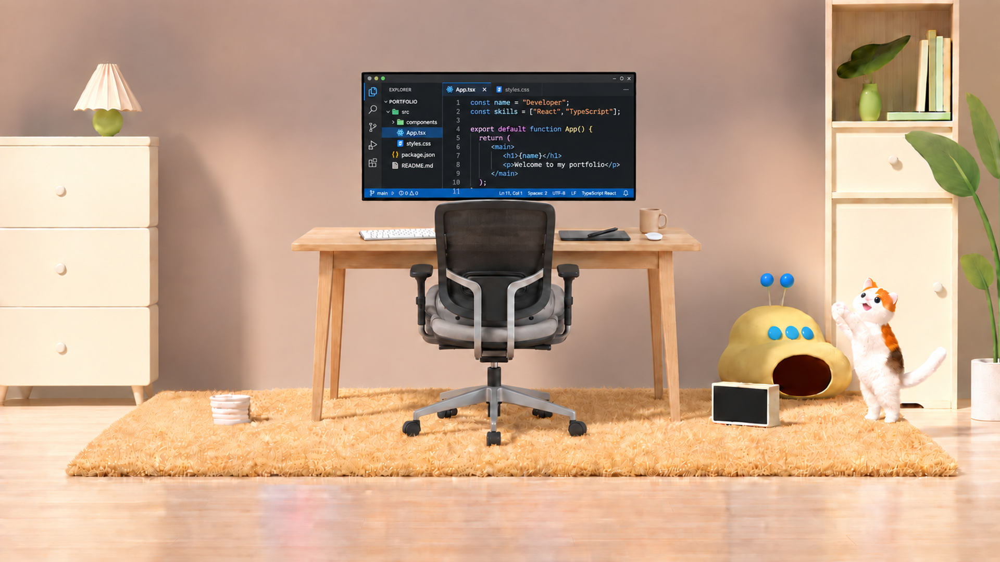

# Variante v4: interfaz de programación

Fecha: 18 de septiembre de 2026.

## Resultado

Se creó una variante independiente de [escena-limpia-full-hd_v4.png](escena-limpia-full-hd_v4.png), usando su [inventario v4](inventario-v4-sin-envases.json) para identificar el grupo **Monitor; contenido de pantalla**.

Dentro del monitor se sustituyeron la interfaz de diseño y la ilustración de café por una interfaz oscura estilo **Visual Studio Code**, con explorador de archivos, pestañas, código con sangría, números de línea, resaltado de sintaxis y barra de estado azul.

## Archivos independientes

| Función                     | Archivo                                                                                |
| --------------------------- | -------------------------------------------------------------------------------------- |
| Imagen Full HD, 1920 × 1080 | [escena-limpia-full-hd_v4-programacion.png](escena-limpia-full-hd_v4-programacion.png) |
| Salida nativa, 1672 × 941   | [escena-limpia-nativa_v4-programacion.png](escena-limpia-nativa_v4-programacion.png)   |
| Inventario de esta variante | [inventario-v4-programacion.json](inventario-v4-programacion.json)                     |
| Prompt exacto y método      | [prompts-v4-programacion.md](prompts-v4-programacion.md)                               |
| Índice de imágenes          | [README.md](README.md)                                                                 |

Esta variante deriva de **v4**, no de v5. El inventario principal y los inventarios anteriores conservan su contenido. Solo se añade una entrada al índice para localizar los nuevos archivos.

## Sustitución del grupo

| ID anterior | Contenido en v4                                                           | Estado en esta variante                                       |
| ----------- | ------------------------------------------------------------------------- | ------------------------------------------------------------- |
| E08         | Interfaz gráfica de diseño con herramientas, paneles y selector de color. | Sustituido por E32–E34.                                       |
| E09         | Ilustración de taza de café, granos, vapor y fondo cálido.                | Sustituido; ya no aparece dentro de la pantalla.              |
| E07         | Marco y cuerpo físico del monitor.                                        | Conservado, con el nuevo contenido dentro de su pantalla.     |
| E13         | Taza física sobre el escritorio.                                          | Conservada; es distinta de la taza dibujada que se sustituyó. |

E08 y E09 mantienen sus nombres y procedencia como registros históricos con estado `sustituido` y coordenadas actuales nulas. `bbox_en_v4` conserva sus posiciones anteriores. Se asignan ID nuevos al contenido de programación para evitar confundirlo con los elementos originales.

## Componentes nuevos para futuras ediciones

Las cajas están expresadas como `[x_min, y_min, x_max, y_max]` en píxeles de la imagen Full HD, con origen en la esquina superior izquierda.

| ID  | Componente                                   | Caja aproximada       | Análisis                                                                                                                                                                 |
| --- | -------------------------------------------- | --------------------- | ------------------------------------------------------------------------------------------------------------------------------------------------------------------------ |
| E32 | Interfaz de programación estilo VS Code      | [699, 144, 1217, 381] | Interfaz oscura completa, con barra de actividad izquierda, pestañas superiores App.tsx y styles.css, paneles y barra de estado azul.                                    |
| E33 | Explorador y lista de archivos del proyecto  | [733, 163, 850, 361]  | Panel izquierdo EXPLORER con árbol PORTFOLIO: carpeta src, subcarpeta components y archivos App.tsx, styles.css, package.json y README.md; App.tsx aparece seleccionado. |
| E34 | Editor con líneas de código TypeScript y JSX | [851, 183, 1217, 361] | Panel central con números de línea, sangría y resaltado de sintaxis. Se distinguen constantes name y skills, una función App y etiquetas JSX main, h1 y p.               |

E32 contiene E33 y E34: son zonas de la misma interfaz y sus cajas se solapan intencionalmente. Los ID E32–E34 se generan en esta variante; no proceden del inventario de la imagen original del escritorio, que llega hasta E31.

El explorador muestra nombres de proyecto, carpetas y archivos dentro del monitor. El editor muestra un fragmento ilustrativo de TypeScript/JSX relacionado con un portafolio. Se ven cadenas como Developer, React y TypeScript, la función App y etiquetas de contenido. Es una representación rasterizada de software, no una sesión real de VS Code ni código editable.

## Elementos conservados

Se mantiene la disposición del monitor, escritorio y patas, silla vacía, teclado, tableta, lápiz digital, taza y objeto ovalado blanco. También permanecen el mueble y lámpara de la izquierda, cuenco blanco O09, alfombra dorada, suelo, dispositivo amarillo, pantalla pequeña O21, gato, mueble derecho, libros, florero y planta.

Los envases O07/O08 y los objetos O10–O19 continúan ausentes. No se reintrodujo la figura humana ni se añadieron palabras flotantes fuera del monitor. Los nombres de archivo y el código dentro de la pantalla están autorizados por esta solicitud.

## Inventario y recuentos

El [inventario independiente](inventario-v4-programacion.json) contiene **54 registros**: los 51 de v4 y tres componentes nuevos. Hay **40 presentes** y **14 ausentes o sustituidos**.

De los presentes, 37 se conservan de v4 y tres describen la nueva interfaz. El aumento de registros se debe a separar interfaz, explorador y código; no significa que se hayan añadido muebles o monitores. Se mantienen los 20 elementos presentes de la habitación y 17 componentes físicos previos del escritorio.

## Método y comprobación

Se realizó una pasada con **image_gen integrada**, categoría `precise-object-edit`, utilizando únicamente la imagen v4. Se conservó el PNG nativo generado y se exportó una copia a Full HD con sharp, interpolación Lanczos3, escalado uniforme aproximado de 14,8 % y ajuste central mínimo de proporción.

La revisión visual confirma la presencia de lista de archivos y líneas de código, ausencia del café ilustrado y de los paneles de diseño anteriores, y conservación de los elementos principales de la habitación.

Se verificaron dimensiones y lectura completa de los PNG, estados y cajas del inventario, relaciones entre E32/E33/E34, enlaces locales y huellas de los archivos anteriores. Las doce imágenes previas permanecen intactas; los JSON existentes también.

La edición generativa puede producir pequeñas variaciones de microtextura fuera de la pantalla. No se garantiza identidad píxel a píxel. Los textos finos son parte de una imagen y el fragmento de código no se entrega como archivo ejecutable. No se incluyen capas ni máscaras.

## Integridad

| Archivo                                   |   Bytes | SHA-256                                                            |
| ----------------------------------------- | ------: | ------------------------------------------------------------------ |
| escena-limpia-full-hd_v4-programacion.png | 3212619 | `7223208FE8DCF4558CD28E8584F8B8809EADC2E4392C97D1729100598D8682FC` |
| escena-limpia-nativa_v4-programacion.png  | 1668326 | `651108A53BBB277BF7C6DD1E1B25B598C23EA5761D157DAE400430B07F704E5D` |

El inventario registra las huellas de las imágenes anteriores y de los inventarios base y principal preservados.
