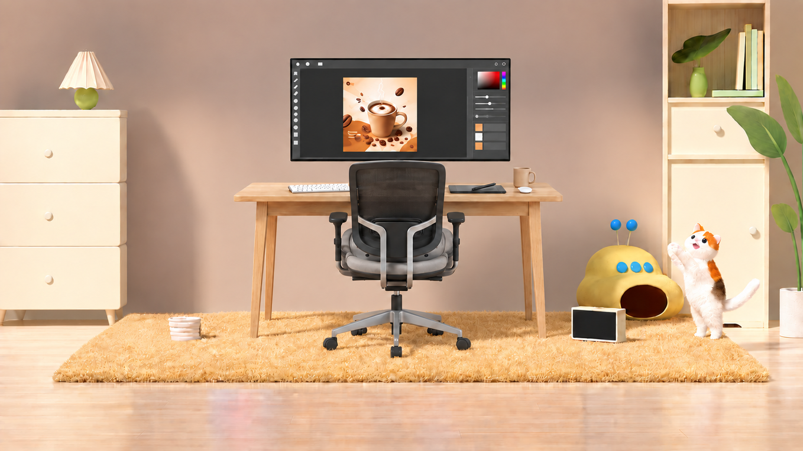

# Escena v4: eliminación de los envases O07 y O08

Fecha: 13 de septiembre de 2026.

## Resultado

Se creó [escena-limpia-full-hd_v4.png](escena-limpia-full-hd_v4.png) como una nueva copia de la [v3](escena-limpia-full-hd_v3.png). Se eliminaron únicamente los dos envases situados en la esquina inferior izquierda: **O07**, blanco/rosa/lavanda, y **O08**, amarillo/lavanda. La zona quedó libre y se reconstruyeron el mueble crema, sus apoyos, el suelo y la continuidad de la alfombra.

El recipiente blanco **O09** permanece. El marco y la interfaz del monitor **E07/E08** también permanecen: sus identificadores pertenecen al escritorio y son distintos de los dos envases retirados. Se conserva el puesto de trabajo completo E04–E22.

## Archivos

| Función                                         | Archivo                                                          |
| ----------------------------------------------- | ---------------------------------------------------------------- |
| Imagen Full HD, 1920 × 1080                     | [escena-limpia-full-hd_v4.png](escena-limpia-full-hd_v4.png)     |
| Salida nativa, 1672 × 941                       | [escena-limpia-nativa_v4.png](escena-limpia-nativa_v4.png)       |
| Inventario de estados, procedencia y posiciones | [inventario-v4-sin-envases.json](inventario-v4-sin-envases.json) |
| Prompt exacto y método                          | [prompts-v4-sin-envases.md](prompts-v4-sin-envases.md)           |
| Imagen base conservada                          | [escena-limpia-full-hd_v3.png](escena-limpia-full-hd_v3.png)     |
| Inventario anterior                             | [inventario-v3-escritorio.json](inventario-v3-escritorio.json)   |
| Índice de versiones                             | [README.md](README.md)                                           |

## Análisis de los objetos eliminados

| ID  | Identificación en v3                                                                                      | Caja aproximada en v3, píxeles | Resultado en v4                                                                           |
| --- | --------------------------------------------------------------------------------------------------------- | ------------------------------ | ----------------------------------------------------------------------------------------- |
| O07 | Bolsa vertical blanca con panel rosa y base lavanda; delante del mueble izquierdo, a la izquierda de O08. | [49, 586, 182, 819]            | Eliminada por completo; sin silueta, pliegues ni reflejo coloreado atribuible a la bolsa. |
| O08 | Bolsa vertical amarilla con zonas crema/lavanda, junto al borde de la alfombra.                           | [182, 567, 322, 802]           | Eliminada por completo; se reconstruyó la unión entre mueble, suelo y alfombra.           |

La numeración del usuario «007» y «008» se corresponde con O07 y O08 en el inventario de la habitación. Se mantienen ambos registros históricos con estado `eliminado`, `eliminado_en: v4` y coordenadas actuales nulas. Su posición en v3 permanece en `bbox_en_v3`; no se renumeran los otros objetos.

## Reconstrucción de las superficies

- **O04, mueble izquierdo:** se completó la superficie del cajón inferior, su tirador y los apoyos visibles. Las partes tapadas por los envases son una reconstrucción generativa coherente con el resto del mueble.
- **O02, suelo:** se prolongaron los tonos y vetas de madera clara y se retiraron los reflejos y sombras vinculados a los envases.
- **O03, alfombra:** se completaron el borde izquierdo y sus fibras doradas. Mantiene su posición y apariencia general.
- **O09, recipiente blanco:** permanece sobre la alfombra, separado del área despejada.

La pared, lámpara, escritorio, silla, monitor, ilustración de café, accesorios, aparato amarillo, pantalla pequeña, gato, muebles derechos, libros y vegetación conservan su identidad y composición general.

## Inventario completo de los elementos presentes

Se conservan **39 registros presentes**: 20 de la habitación y 19 componentes del escritorio. El total del inventario sigue siendo 51, incluyendo 12 registros ausentes. Estos recuentos incluyen partes de muebles y contenido de pantalla; no equivalen a objetos físicos independientes.

Las cajas siguientes están expresadas como `[x_min, y_min, x_max, y_max]` en la imagen final de 1920 × 1080, con origen en la esquina superior izquierda. Son referencias aproximadas revisadas visualmente, no máscaras de recorte.

| ID  | Objeto o componente                          | Caja aproximada v4     | Estado y observación                                                                                                                  |
| --- | -------------------------------------------- | ---------------------- | ------------------------------------------------------------------------------------------------------------------------------------- |
| O01 | Pared del fondo                              | [0, 0, 1920, 780]      | Conservado desde v3 en posición, identidad y apariencia general; posibles variaciones generativas de detalle fino.                    |
| O02 | Suelo                                        | [0, 745, 1920, 1080]   | Suelo de madera conservado. Se reconstruyó la porción antes oculta por O07/O08, retirando sus sombras y reflejos coloreados.          |
| O03 | Alfombra                                     | [120, 747, 1848, 920]  | Alfombra dorada conservada; borde izquierdo y fibras reconstruidos en la zona contigua a los envases retirados.                       |
| O04 | Mueble bajo izquierdo                        | [0, 264, 310, 783]     | Mueble crema conservado; frente inferior, tirador, base y patas visibles se completaron donde los envases tapaban la superficie.      |
| O05 | Pantalla de la lámpara                       | [139, 123, 273, 220]   | Conservado desde v3 en posición, identidad y apariencia general; posibles variaciones generativas de detalle fino.                    |
| O06 | Base verde de la lámpara                     | [174, 213, 238, 266]   | Conservado desde v3 en posición, identidad y apariencia general; posibles variaciones generativas de detalle fino.                    |
| O09 | Recipiente pequeño blanco                    | [397, 755, 484, 818]   | Recipiente blanco acanalado conservado a la izquierda del escritorio, sobre la alfombra; no forma parte de los dos objetos retirados. |
| O20 | Dispositivo amarillo de apariencia musical   | [1375, 524, 1642, 775] | Conservado desde v3 en posición, identidad y apariencia general; posibles variaciones generativas de detalle fino.                    |
| O21 | Pantalla rectangular con marco crema         | [1365, 733, 1499, 821] | Conservado desde v3 en posición, identidad y apariencia general; posibles variaciones generativas de detalle fino.                    |
| O22 | Gato pequeño blanco con manchas              | [1594, 534, 1825, 818] | Conservado desde v3 en posición, identidad y apariencia general; posibles variaciones generativas de detalle fino.                    |
| O23 | Mueble alto derecho                          | [1584, 0, 1844, 787]   | Conservado desde v3 en posición, identidad y apariencia general; posibles variaciones generativas de detalle fino.                    |
| O24 | Florero verde del nicho                      | [1647, 158, 1699, 238] | Conservado desde v3 en posición, identidad y apariencia general; posibles variaciones generativas de detalle fino.                    |
| O25 | Hoja oscura del florero                      | [1604, 66, 1751, 157]  | Conservado desde v3 en posición, identidad y apariencia general; posibles variaciones generativas de detalle fino.                    |
| O26 | Libro vertical izquierdo, crema              | [1757, 79, 1788, 220]  | Conservado desde v3 en posición, identidad y apariencia general; posibles variaciones generativas de detalle fino.                    |
| O27 | Libro vertical alto, verde pálido            | [1779, 58, 1801, 220]  | Conservado desde v3 en posición, identidad y apariencia general; posibles variaciones generativas de detalle fino.                    |
| O28 | Libro vertical verde menta                   | [1797, 71, 1813, 220]  | Conservado desde v3 en posición, identidad y apariencia general; posibles variaciones generativas de detalle fino.                    |
| O29 | Libro vertical derecho, marfil               | [1810, 76, 1827, 220]  | Conservado desde v3 en posición, identidad y apariencia general; posibles variaciones generativas de detalle fino.                    |
| O30 | Libro horizontal verde                       | [1701, 219, 1828, 237] | Conservado desde v3 en posición, identidad y apariencia general; posibles variaciones generativas de detalle fino.                    |
| O31 | Planta grande del extremo derecho            | [1734, 177, 1920, 803] | Conservado desde v3 en posición, identidad y apariencia general; posibles variaciones generativas de detalle fino.                    |
| O32 | Maceta blanca de la planta grande            | [1860, 689, 1920, 813] | Conservado desde v3 en posición, identidad y apariencia general; posibles variaciones generativas de detalle fino.                    |
| E04 | Tablero del escritorio                       | [558, 436, 1347, 487]  | Tablero de madera clara integrado en el centro, delante de la pared y detrás de la silla, con los accesorios apoyados.                |
| E05 | Faldón y travesaños del escritorio           | [609, 482, 1303, 521]  | Faldón y travesaños bajo el tablero, parcialmente ocultos por la silla.                                                               |
| E06 | Patas del escritorio                         | [593, 482, 1311, 815]  | Patas del escritorio apoyadas sobre la alfombra dorada O03, con sombras integradas.                                                   |
| E07 | Marco y cuerpo del monitor                   | [692, 139, 1223, 390]  | Un monitor principal apaisado y de marco negro, sobre la mesa, sin pie visible; distinto de la pequeña pantalla O21.                  |
| E08 | Interfaz gráfica dentro del monitor          | [702, 146, 1214, 380]  | Interfaz oscura sin palabras legibles, con controles geométricos y selector de color.                                                 |
| E09 | Ilustración de café en la pantalla           | [819, 186, 999, 366]   | Ilustración vertical de taza de café, vapor y granos en el interior de la pantalla; no es una segunda pantalla.                       |
| E10 | Teclado blanco                               | [687, 438, 839, 466]   | Teclado blanco en el lado izquierdo del tablero, parcialmente tapado por la silla.                                                    |
| E11 | Superficie rectangular oscura de trabajo     | [1071, 442, 1213, 467] | Tableta oscura sobre el lado derecho de la mesa.                                                                                      |
| E12 | Lápiz digital o estilete                     | [1127, 437, 1190, 461] | Un lápiz digital apoyado en diagonal sobre la tableta; no se importó la pluma flotante del donante.                                   |
| E13 | Taza física crema con asa                    | [1225, 400, 1283, 452] | Taza física crema con asa en el extremo derecho de la mesa.                                                                           |
| E14 | Objeto ovalado blanco junto a la taza        | [1239, 446, 1275, 465] | Pieza ovalada blanca interpretada como ratón, delante de la taza; conserva la ambigüedad documentada en el origen.                    |
| E15 | Respaldo oscuro de la silla                  | [833, 388, 1068, 612]  | Respaldo negro de malla de una silla vacía vista desde atrás, orientada hacia el monitor.                                             |
| E16 | Armazón posterior y soporte gris de la silla | [813, 388, 1091, 699]  | Armazón gris de la silla, con montantes posteriores que conectan con el mecanismo inferior.                                           |
| E17 | Asiento y cojín de la silla                  | [814, 547, 1097, 670]  | Asiento y cojín grises entre los apoyabrazos, sin persona.                                                                            |
| E18 | Apoyabrazos izquierdo de la silla            | [785, 508, 835, 649]   | Apoyabrazos izquierdo desde la perspectiva del observador.                                                                            |
| E19 | Apoyabrazos derecho de la silla              | [1067, 506, 1115, 649] | Apoyabrazos derecho, unido al mismo asiento.                                                                                          |
| E20 | Columna elevadora de la silla                | [932, 690, 969, 755]   | Columna central vertical que conecta el asiento y la base de la silla.                                                                |
| E21 | Base estrellada de la silla                  | [774, 737, 1123, 837]  | Base radial gris de la silla, sobre la alfombra dorada.                                                                               |
| E22 | Ruedas de la silla                           | [771, 779, 1125, 859]  | Ruedas negras en los extremos de los radios; se preservan apoyos y sombras.                                                           |

## Objetos ausentes y continuidad entre versiones

| ID  | Objeto                                              | Estado en v4 | Versión del cambio |
| --- | --------------------------------------------------- | ------------ | ------------------ |
| O07 | Envase blanco, rosa y lavanda                       | eliminado    | v4                 |
| O08 | Envase amarillo y lavanda                           | eliminado    | v4                 |
| O10 | Respaldo y base azul del asiento                    | sustituido   | v3                 |
| O11 | Cabeza del gato grande                              | eliminado    | v2                 |
| O12 | Cuerpo naranja del gato grande                      | eliminado    | v2                 |
| O13 | Pata delantera levantada y bandas turquesa          | eliminado    | v2                 |
| O14 | Extremo elevado derecho del gato: pata/cola curvada | eliminado    | v2                 |
| O15 | Figura humana recostada                             | eliminado    | v2                 |
| O16 | Varilla azul                                        | eliminado    | v2                 |
| O17 | Cordón del juguete                                  | eliminado    | v2                 |
| O18 | Señuelo naranja con forma de pez                    | eliminado    | v2                 |
| O19 | Personaje/accesorio magenta colgante                | eliminado    | v2                 |

O10 continúa sustituido por el escritorio desde v3. O11–O19 siguen ausentes desde v2; no reaparecen la figura humana, el gato grande, su juguete ni el personaje magenta. No se importaron nuevos componentes del donante en esta edición.

## Método y calidad del archivo

Se realizó una pasada con la herramienta integrada **image_gen**, en la categoría `precise-object-edit`, usando únicamente la v3 como imagen de entrada. El [prompt](prompts-v4-sin-envases.md) registra los objetos retirados y las restricciones de conservación.

La salida nativa mide 1672 × 941. La entrega Full HD mide **1920 × 1080**, PNG RGB opaco. Se exportó con escalado uniforme Lanczos3 de aproximadamente 14,8 % y ajuste central mínimo de proporción mediante sharp. El archivo nativo se conserva; el escalado no representa detalle generado originalmente a 1920 × 1080.

## Revisión del resultado y límites

- O07 y O08 no son visibles; no se observan restos de los envases en el mueble, el suelo ni el borde de la alfombra.
- O09, E07 y E08 siguen presentes. Se mantiene un monitor principal, una silla vacía, los accesorios del escritorio y la pequeña pantalla O21.
- La escena conserva el encuadre y la iluminación cálida. No se observan personas, textos flotantes ni palabras legibles añadidas; el teclado conserva pequeños contrastes gráficos.
- Se comprobaron las dimensiones y la lectura completa de los PNG, los estados y coordenadas del inventario, los enlaces locales y las huellas de las imágenes anteriores.
- La edición generativa puede variar ligeramente las microtexturas fuera de la zona retirada; no se afirma identidad píxel a píxel. Las superficies ocultas se reconstruyen, no se recuperan de una fuente original.
- La imagen es plana y opaca: no incluye capas ni máscaras de objetos.

## Registros actualizados

El [inventario principal](inventario-objetos.json) registra v4 como variante más reciente sin cambiar sus objetos históricos de v1. El [inventario v3](inventario-v3-escritorio.json) incorpora el enlace a su derivada; el reporte y prompt de v3 señalan esta nueva copia conservando sus descripciones originales.

El [índice de la habitación](README.md), el [reporte principal](reporte-analisis.md), el [índice del escritorio](../escena-escritorio/README.md) y el [inventario del donante](../escena-escritorio/escritorio-inventario-objetos.json) enlazan la nueva versión o registran la continuidad de E04–E22. Las ocho imágenes previas —v1, v2, v3 y escritorio, cada una con su salida nativa— se conservaron sin modificar su contenido.

## Integridad

| Archivo                      | Tamaño en bytes | SHA-256                                                            |
| ---------------------------- | --------------: | ------------------------------------------------------------------ |
| escena-limpia-full-hd_v4.png |         3182306 | `BCA67DA96BF6BDE3DC853559F9166E3EBE44C964DDCF9ACB4751B5E11ECBB265` |
| escena-limpia-nativa_v4.png  |         1663766 | `19A85867E706C9F34906DBE8C0665D946F43A4F328139B1B1C1ED8F8194807D7` |

Las huellas de los ocho PNG anteriores se incluyen en `imagenes_anteriores_preservadas` del inventario v4.
