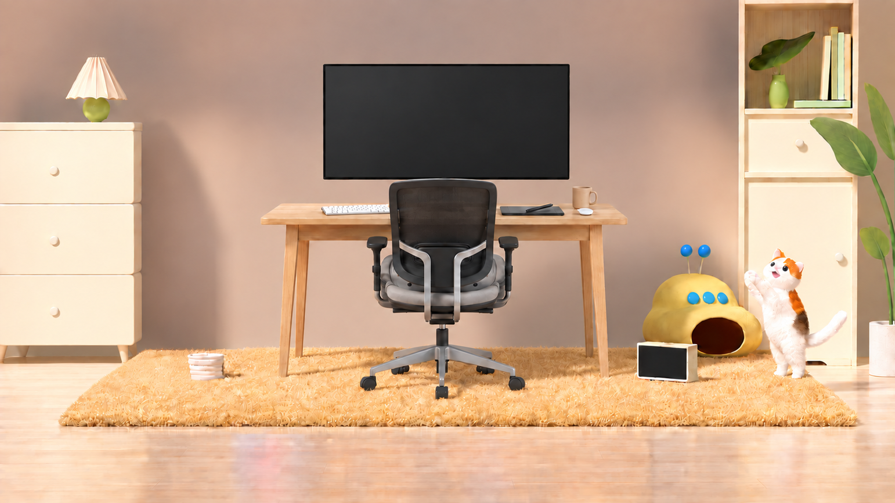

# Escena v5: monitor sin contenido de pantalla

Fecha: 16 de septiembre de 2026.

## Resultado

Se creó una [imagen v5 Full HD](escena-limpia-full-hd_v5.png) a partir de la [v4](escena-limpia-full-hd_v4.png), retirando los dos registros cuyo campo `grupo` coincide exactamente con **Monitor; contenido de pantalla**. La pantalla del monitor queda vacía y oscura; se conserva el monitor físico E07.

## Objetos afectados

| ID  | Objeto                              | Caja aproximada en v4  | Estado en v5                                                                                       |
| --- | ----------------------------------- | ---------------------- | -------------------------------------------------------------------------------------------------- |
| E08 | Interfaz gráfica dentro del monitor | [702, 146, 1214, 380]  | Eliminado: sin herramientas, barras, controles, paneles, selector de color ni iconos.              |
| E09 | Ilustración de café en la pantalla  | [819, 186, 999, 366]   | Eliminado: sin la taza dibujada, vapor, granos ni fondo de la ilustración.                         |
| E07 | Marco y cuerpo del monitor          | [692, 139, 1223, 390]  | Conservado, con superficie de pantalla oscura vacía; caja actual aproximada [692, 137, 1224, 388]. |
| E13 | Taza física crema con asa           | [1225, 400, 1283, 452] | Conservada sobre el escritorio; es distinta de la taza representada en E09.                        |

El interior de la pantalla se completó con una superficie gris carbón oscura de sombreado suave. Se conserva el marco negro y la disposición del monitor sobre la silla y el escritorio, sin añadir un soporte.

El puesto de trabajo mantiene escritorio, patas, silla vacía, teclado, tableta, lápiz digital, taza y objeto ovalado blanco. Se conservan los muebles laterales, lámpara, cuenco O09, alfombra, aparato amarillo, pantalla pequeña O21, gato, libros, florero y planta. O07/O08 y O10–O19 continúan ausentes.

## Inventario actualizado en el archivo existente

Se modificó directamente [inventario-objetos.json](inventario-objetos.json). **No se creó otro archivo JSON.**

- `archivo_final`, `imagenes`, `objetos` y `recuento` describen ahora v5.
- E08 y E09 figuran como `eliminado`, con `eliminado_en: v5`; sus cajas actuales y normalizadas son nulas. `bbox_en_v4` conserva las posiciones anteriores.
- E07 sigue presente y su descripción refleja la pantalla vacía.
- El grupo de composición contiene únicamente los 17 componentes de escritorio presentes; E08/E09 se enumeran aparte como retirados.
- Los 51 ID originales se mantienen: **37 presentes** (20 de la habitación y 17 del escritorio) y **14 ausentes** (13 eliminados y O10 sustituido). Son registros de objetos, piezas y contenido gráfico, no necesariamente objetos físicos independientes.
- `historial_inventarios.v1` conserva una copia completa del inventario principal previo, incluyendo su análisis de v1 y los registros de variantes hasta v4. Los campos históricos se distinguen del estado actual en el nivel superior.
- Los otros cuatro JSON existentes de ambas carpetas permanecen intactos.

## Archivos de la entrega

| Función                          | Archivo                                                          |
| -------------------------------- | ---------------------------------------------------------------- |
| Imagen final, 1920 × 1080        | [escena-limpia-full-hd_v5.png](escena-limpia-full-hd_v5.png)     |
| Salida nativa, 1672 × 941        | [escena-limpia-nativa_v5.png](escena-limpia-nativa_v5.png)       |
| Inventario principal actualizado | [inventario-objetos.json](inventario-objetos.json)               |
| Prompt exacto y método           | [prompts-v5-monitor-vacio.md](prompts-v5-monitor-vacio.md)       |
| Índice de versiones              | [README.md](README.md)                                           |
| Inventario de la base histórica  | [inventario-v4-sin-envases.json](inventario-v4-sin-envases.json) |

## Método, comprobación y límites

Se realizó una pasada de edición localizada con **image_gen integrada**, categoría `precise-object-edit`, usando únicamente v4 como referencia. La generación produjo un PNG de 1672 × 941; se exportó a 1920 × 1080 con sharp, interpolación Lanczos3, escalado uniforme de aproximadamente 14,8 % y ajuste central mínimo de proporción. La exportación no aporta detalle nativo adicional.

La revisión visual confirma una pantalla sin interfaz ni ilustración de café, conservación del monitor E07 y de la taza física E13, y ausencia de reapariciones de los objetos retirados en entregas anteriores. Las diez imágenes anteriores permanecen independientes, con las mismas huellas SHA-256.

Se comprobaron la lectura completa y dimensiones de los PNG, los recuentos y coordenadas del inventario, el historial conservado, los enlaces locales y la ausencia de JSON adicionales.

La edición generativa puede introducir variaciones finas de textura fuera de la pantalla; no se afirma igualdad píxel a píxel. Las cajas son aproximadas y la imagen es un PNG RGB opaco, sin capas ni máscaras.

## Integridad de los nuevos PNG

| Archivo                      |   Bytes | SHA-256                                                            |
| ---------------------------- | ------: | ------------------------------------------------------------------ |
| escena-limpia-full-hd_v5.png | 3142908 | `A4E5BE6A0A8E6E8CC7FF8ED1BF6D17BC8E95C2EFEE1BE1379E97FBE22DA546FC` |
| escena-limpia-nativa_v5.png  | 1622170 | `3D4E5843FE3ACF171B4A0AAF92F143784EAA5AA6AB21F50F9C0398D4E615CD05` |

Las huellas de las diez imágenes anteriores figuran en `imagenes_anteriores_preservadas` del inventario principal. El índice, el reporte general y la documentación histórica relevante distinguen ahora el inventario actual de sus instantáneas anteriores.
